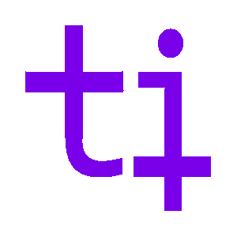
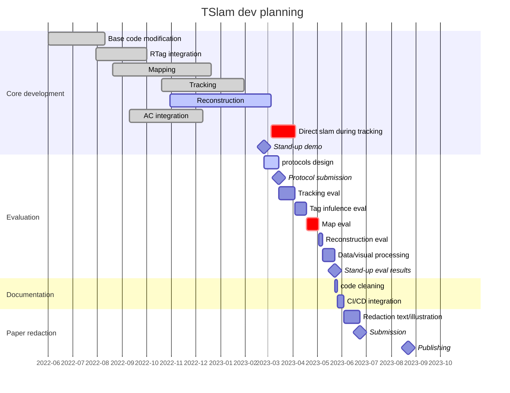

<p align="center">
    
</p>
<p align="center">
    
</p>



# TSlam
This is a modified version of [UcoSLAM](http://www.uco.es/investiga/grupos/ava/node/62) for augmented carpentry research. The main features are:
- Better API for use.
- Using [STag](https://github.com/bbenligiray/stag)
- Can do map fusion (merging one map into another).
- By indicating it's in instance mode, the system stop running global optimization and only keeps a fixed number of new added keyframes, which smooth the overall experience.
- Add [CLAHE](https://en.wikipedia.org/wiki/Adaptive_histogram_equalization) for preprocessing.
- Several [bugs are resolved](./dev_log/Bug_tracing.md).
- we add a reconstruction pipeline to obtain digital models of the physically tagged objects

Here are some reference related to this project:
- The publication for UcoSLAM:  [link]([https://docs.google.com/document/d/12EGJ3cI-m8XMXgI5bYW1dLi5lBO-vxxr6Cf769wQzJc](https://arxiv.org/abs/1902.03729))
- [STag ROS](https://github.com/usrl-uofsc/stag_ros): Code of STag is from this repo. This one upgrade the original STag from OpenCV 3 to OpenCV 4.
- [Dev Log of this modification](./dev_log)

## STag to print
An A0 format with all STag stripes can be downloaded [here](https://drive.google.com/file/d/1a_uYvb9TZmeg664L9f9kR5GuTU0A3bfs/view?usp=share_link).

## Scanned Map
Some scanned map can be download from [[Google Drive](https://drive.google.com/drive/folders/1wYFZq54syWwTFVQ5soJTMVUmcufcvQoT?usp=share_link)](You have to login with EPFL account to view).

## Build
```bash
# install library (compile from source opencv 4.5.5)
sudo apt-get update
sudo apt-get install cmake qtbase5-dev libqt5opengl5-dev libopenni2-dev
git clone https://github.com/ibois-epfl/TSlam.git
cd TSlam

mkdir build && cd build
cmake ../ -DBUILD_4_API=OFF  # (ON: if building as API with no GUI)
make -j$(nproc)

sudo make install  # if building as API
```

## Run with you camera:
In this project, we provide you an example executable to run the monocular slam.
After building, a file `monocular_slam` will be generated in `build/utils`. You can run it with your camera through the
following commend. Note that two extra parameters are needed, video source and path to the camera calibration matrix. 
``` bash
cd build/util

# ./monocular_slam [{path_to_video}|live:{camera_index}] {camera_calibration_file}]
./monocular_slam live:0 camera_calibration.yml
```
Here are some optional parameters: 
- `-voc`: Path to the vocabulary file for the feature describer. If an input map is specified, this is not needed;
otherwise, you won't be able to run mapping. In the root folder we provide `orb.fbow` for you to use.
- `-out`: Path to the output map.
- `-map`: Path to the input map.
- `-outvideo`: Path to the output video. (You should specify the file extension, use `.mp4` if you have no preference).
- `-undistort`: True or false to enable the undistortion (based on the distortion matrix in the camera calibration file)
- `-enableLoopClosure`: True or false to enable the optimization when loop closure of tag is detected. Recommend to set it 
to false to prevent the dramatic lag during mapping.
- `-outCamPose`: Path to the output of the camera pose. The file will be a txt file with record in following format: `frameID posX posY posZ rotW rotX rotY rotZ` (separate by space)
- `-drawMesh`: Path to the mesh to draw (in `.ply`) The mesh should be generated by the same input map.

## Run with examples (monocular video):
If you don't have a camera or for some other reason that you can't run the monocular slam, you can follow the instruction
to run the minimal example.
### Minimal example:
```bash
cd build/utils
unzip ../../example/example.map.zip -d ../../example/
./tslam_minimal_example
```
This runs `tslam_minimal_example.cpp`, which takes the `example.map` and `video.mp4` in `/example` as input to show a brief demo.

### Mapping
```bash
./tslam_monocular ../../example/video.mp4 ../../example/calibration_webcam.yml -voc ../../orb.fbow -out test
```
This runs `monocular_slam.cpp`.
- `2nd argument`: Input source, "live" indicates the camera[0], to use another camera, use "live:N" instead.
- `3rd argument`: Path to the camera parameter file.
- `-voc`: Path to vocabulary file.
- `-out`: Name of the output map, it will be saved with extension `.map` (in this case, `test.map`)
Run without args to check all the avaliable ones.

When the window pop-out, you can press `f` to enable the 3D tracking and `s` to start/stop the video.

> [!] Vocabulary is not required, but it will not be able to relocalization with keypoints if not specified.

### Reconstruction
```bash
./tslam_reconstruct "src/reconstruction/tests/test_data/real_scans/long_cut.yml" "./" "test_mesh_name"
```
This runs `tslam_reconstruct.cc`.
- `<path_to_map_yml>`: the path pointing to the `.yml` file of the map
- `<output_dir>`: the output dir for the reconstructed mesh
- `<mesh_name>`: the name of the `.ply` file
It's possible to input the parameters for the geometric solver. To see them, run `./tslam_reconstruct -h`

### Tracking
`>>>>>>>>>>>>>>>>>> TODO <<<<<<<<<<<<<<<<<<<<`
Here we should add the path to the mesh model to visualize

```bash
# first unzip the map
unzip ../../example/example.map.zip -d ../../example/
./tslam_monocular ../../example/video.mp4 ../../example/calibration_webcam.yml -map ../../example/example.map -isInstancing
```
- `map`: Path to the map.
- `isInstancing`: Indicating it's not mapping, so we can skip some operations.

### Util Programs
`>>>>>>>>>>>>>>>>>> this is for me not clear why we need to show this, maybe the previous section needs to be explained better. We should replace it with the typical routine with all the steps to map, reconstruct and run tslam. <<<<<<<<<<<<<<<<<<<<`
Some utility programs would be built defautly in `build/utils`
#### View Map
```bash
./tslam_mapviewer example.map
```
#### Combine Maps
```bash
./tslam_combine_map A.map B.map AB_comb.map
```
#### Export Maps
```bash
./tslam_map_export example.map example.[pcd|ply|yml]
```
#### Reconstruct model
`>>>>>>>>>>>>>>>>>> here we need to add <<<<<<<<<<<<<<<<<<<<`

## APIs
### Header
All interface is included in `tslam.h`.
```cpp
#include "tslam.h"
#include "reconstruction/tslam_reconstructor.hh"
```

---

### Class `TSlam`
#### Initilization
```c++
tslam::TSlam *slam = new tslam::TSlam;

/** Set path to the binary map **/
slam->setMap("long_new_param_comb.map");

/**
 * Set path to the .fbow file.
 * If map is already setted, this can be skipped
 **/
slam->setVocabulary("../../orb.fbow");

/**
 * Indicate if it's instancing or mapping.
 * When set to true, global optimization will be turned off and
 * the the new added key-frames will be kept in a fix number by
 * continuely deleting the old ones.
 **/
slam->setInstancing(true);

/**
 * Set path to the camera calibration matrix.
 * The structure of the .yml file is described below.
 **/
slam->setCamParams("../../example/calibration_webcam.yml");
```
- Example `calibration_webcam.yml`:
    ```yml
    %YAML:1.0
    ---
    image_width:852
    image_height:480
    camera_matrix: !!opencv-matrix
        rows: 3
        cols: 3
        dt: f
        data: [832.069, 0, 424.286, 0, 831.192, 242.936, 0, 0, 1 ]
    distortion_coefficients: !!opencv-matrix
        rows: 1
        cols: 5
        dt: f
        data: [0.274109, -1.71439, 0.00250987, 5.0718e-05, 3.46554 ]
    ```

#### Member Functions
```c++
cv::Mat getLastTrackedCamPose();
```
- Get the last tracked camera pose (not guarentee to be the last frame)
- **Return:** A 4x4 cv::Mat; cv::Mat::eye if not tracked ever.

```c++
bool process(cv::Mat frame, cv::Mat &camPose);
```
- Process a frame.
- **Params:**
    - `cv::Mat frame`: Frame to process.
    - `cv::Mat &camPose`: The reference will be updated to the camera pose of the frame.

```c++
std::shared_ptr<Map> getMap();
```
- Get the pointer to the map being used
- **Return:** A `std::shared_ptr<Map>` point to the map in use.

```c++
void clearMap();
```
- Clear the map. This will open a new empty map and reinitialize the slam backend.


---
### Class `Map`
This is is responsible for the first step of TSLAM, mapping the rtags attached to the piece. The class needs a vocabulary of the rtags and output a yml file that can be used during at runtime to run the TSlam.
#### Member Functions
```cpp
void saveToFile(std::string fpath);
```
- Save the (binary) map to a file.
- **Params:**
    - `std::string fpath`: Read/save path.

```cpp
void saveToMarkerMap(std::string filepath)const;
```
- Saves the set of markers to a marker map file (.yml) that can be used with aruco.
- **Params:**
    - `std::string filepath`: Save path, should include the extension (.yml)

```cpp
void merge(std::shared_ptr<Map> mapB);
```
- Merge mapB into this.
- **Params:**
    - `std::shared_ptr<Map> mapB`: Another map

```cpp
void optimization(int niters=50);
```
- Run fullba optimization.
- **Params:**
    - `niters`: Number of iterations(default = 50).


---
### Class `TSLAMReconstructor`
This is the class responsible for reconstructing the mesh model of the timber piece from the `.yml` file produced by the class `Map`.
If you want to test new features or make modifications to the reconstruction API you can compile the sub-program as a console app with a visual debugger powered by Open3d.
```bash
cd TSlam/src/reconstruction

cmake -S . -B build -DENABLE_O3D_VISUAL_DEBUG=ON -DENABLE_TESTING=ON
cmake --build build
```
You can go in the unit test series in `TSlam/src/reconstruction/tests/test_gsolver.cc` to see all the tests for different reconstruction of shapes.

#### Initilization

```cpp
// load map for construction
reconstructor.loadMap(ymlPath);

// reconstruct!
reconstructor.run();

// save mesh to path
reconstructor.saveMeshAsPLY("<dir>", "<name>");

// clean everything
reconstructor.clean();
```

#### Member Functions
```cpp
void setParams(float radiusSearch,
                double creaseAngleThreshold,
                int minClusterSize,
                double maxPlnDist,
                double maxPlnAngle,
                double aabbScaleFactor,
                double maxPolyDist,
                double eps);
```
- Geometric reconstructor's parameters. They are set by default by you can change them with this function.
- **Params**:
    - `float radiusSearch`: the radius of the search for the nearest tag neighbors
    - `double creaseAngleThreshold`: the threshold for detection of crease's angle (the smaller the more creases will be detected)
    - `int minClusterSize`: the maximal number of nearest neighbors cluster to be created
    - `double maxPlnDist`: the max threshold distance for two planes to be considered aligible for merging
    - `double maxPlnAngle`: the maximal distance between a polygon and a tag to be considered as a candidate face
    - `double aabbScaleFactor`: the scale factor for scaling up the AABB of the timber element
    - `double maxPolyDist`: the maximal angle difference in degs between two planes'normals' angle to be eligible for merging
    - `double eps`: the tolerance for all the computation (e.g. for the intersections)

```cpp
void loadMap(const std::string& filepath);
```
- load the `.yml` map containing the tags
- **Params**:
  - `const std::string& filepath`: the path pointing to the `.yml` map file of the tags

```cpp
bool run();
```
- it run the geometric solver to generate the shape

```cpp
void saveMeshAsPLY(const std::string& dir, const std::string& filename);
```
- It saves the reconstructed mesh locally.
- **Params**:
  - `const std::string& dir`: directory to save the mesh
  - `const std::string& filename`: name of the mesh file

```cpp
void clean()
```
- Clean the data attached to the reconstructor in case it has to be run again.

```cpp
TSGeometricSolver& getGeometricSolver()
```
- An utility getter func to retrive the geometric solver and access its internal parameters. Normally not needed. More for debug or dev.


## Other
- `/example`: An example video for mapping and tracking.
- `/post_processing/cluster.py`: Taking the tag map (the one exported by `reslam_map_export`) as input and perform 3d plane fitting.
- `/stag_util/sticker_generator.py`: Script for generating the STag sticker.

## License
GPLv3
