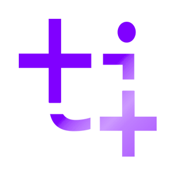
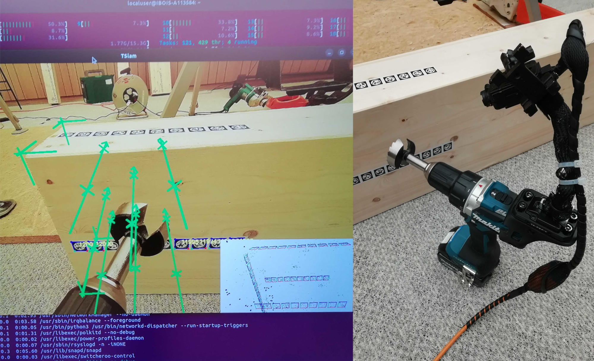
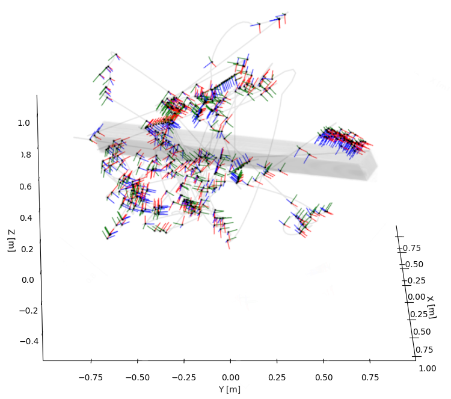
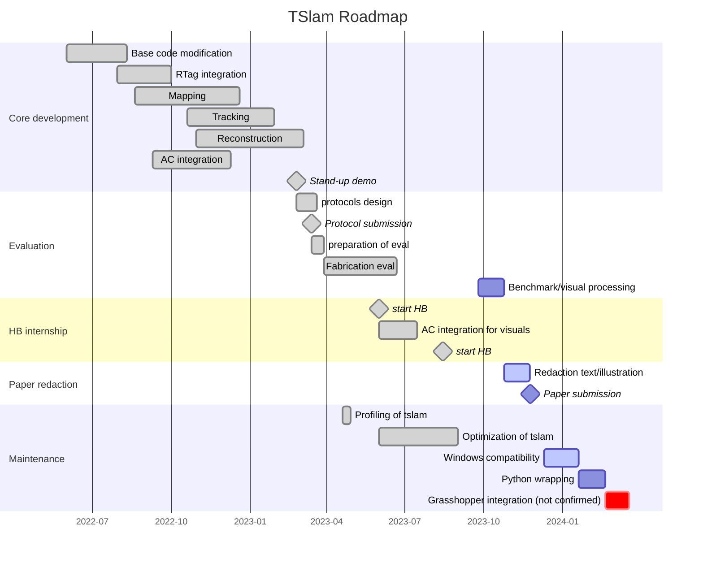

<p align="center">
    
</p>
<p align="center">
    <a href="https://doi.org/10.5281/zenodo.10093230"></a>
    
    
    
    
    
</p>

<p align="center">
    
    
</p>
<p align="center">
    <i><small>Augmented interface for woodworking powered by the TSlam's navigation system for subtractive fabrication. After the object is mapped, you can move it, cut it, or drill it and the camera will still be able to self-localize. </small></i>
</p>

🪵🌲 `TSlam` is developed at the [**Laboratory for Timber Construction**](https://www.epfl.ch/labs/ibois/) (director: Prof.Yves Weinand), at [**EPFL**](https://www.epfl.ch/en/), Lausanne, Switzerland. The project is part of the [**Augmented Carpentry Research**](https://www.epfl.ch/labs/ibois/augmented-carpentry/).

🪚🔨 `TSlam` is an open-source **object-centered**, tag-based visual **navigation software for monocular RGB cameras** specifically developed in C++ and for UNIX systems to support a robust and accurate augmented reality pipeline for close-range, noisy, and cluttered fabrication sequences involving **wood-working operations** such as cutting, drilling, sawing and screwing with multiple tools and end-effectors.

🖧 `TSlam` leverages and combines multiple open-source projects ([UcoSLAM](http://www.uco.es/investiga/grupos/ava/node/62), [STag](https://github.com/bbenligiray/stag), [CGAL](https://www.cgal.org/)) to obtain a functional pipeline that can map, 3D reconstruct, and finally provide a robust camera pose stream at fabrication time to overlay an execution model with its digital twin model.

🔖 `TSlam` was under development and testing for more than a year. For more details about the development go in the [Dev Log](./dev_log)

↳ `TSlam` can be imported as a C++ API in your project or used as an executable.


## Benchmark

To benchmark the proposed navigation system under real fabrication scenarios, we produced a dataset of 1344 close-up different woodworking operations with multiple tools, tool heads, and varying parameters such as tags' layout and area density. The evaluation campaign indicates that TSlam is satisfyingly capable of detecting the camera's millimetric position and sub-angular rotation during the fabrication sequences to the exception of the saber saw. The dataset can be found [here](https://zenodo.org/record/8377793).

<p align="center">

</p>
<p align="center"><i><small>One of the sub-sequences of the dataset was evaluated with an Optitrack system to obtain ground truth trajectories. In magenta: the ground-truth, in dark cyan: tslam tracking. </i></small></p>
    
## Tag stickers
<p align = "center">
   </img>
</p>
<p align = "center">
  <i><small>Example of a stripe as sticker employed in TSlam. Each stripe contains 50 fiducial markers of 20mm width.</small></i>
</p>

There are two ways you can consume the tags:
- `ready to print`: 450 stripes for a total of 21149 tags are available in batches of 50 stripes with an A0 format. They are ready to print (better as stickers) and can be downloaded [here](https://zenodo.org/record/7738721/files/stag_stickers_ready.zip?download=1).
- `generate your custom stripes`: if you need a specific tags layout you can run the python script from the terminal (from UNIX):
  `calibration_webcam.yml -voc ../../orb.fbow -out test`

## Build
```bash
# install library (compile from source opencv 4.5.5)
sudo apt-get update
sudo apt-get install cmake qtbase5-dev libqt5opengl5-dev libopenni2-dev
git clone https://github.com/ibois-epfl/TSlam.git
cd TSlam

mkdir build && cd build
cmake ../ -DBUILD_4_API=OFF  # (ON: if building as API with no GUI)
make -j$(nproc)

sudo make install  # if building as API
```

## Run monocular slam as executable:
In this project, we provide you an example executable to run the monocular slam.
After building, an executable `tslam_monocular` will be generated in `build/utils`. You can run it with the following commend. Note that two extra parameters are needed: **video source** and path to the **camera calibration file**. 

In the `example` folder, we provide you an example video, a camera calibration file, and a map for you to test.

You first need to stick the tags your timber piece, do the mapping and later use the output map and reconstructed model to run the tracking.

``` bash
cd build/util

# ./tslam_monocular [{path_to_video}|live:{camera_index}] {camera_calibration_file}]
./tslam_monocular live:0 camera_calibration.yml
```
Here are some optional parameters: 
- `-voc`: Path to the vocabulary file for the feature describer. If an input map is specified, this is not needed;
otherwise, you won't be able to run mapping. In the `assets/voc` folder we provide `orb.fbow` for you to use.
- `-out`: Path to the output map.
- `-map`: Path to the input map.
- `-exportVideo`: Path and filename (without extension) to the output video. A video `[file/path/and/name].mp4` will be exported, containing the processed frames with SLAM information.
- `-exportRawVideo`:  Path and filename (without extension) to the output RAW video. A video `[file/path/and/name]_raw.mp4` will be exported, containing the original frames captured by the camera (exclude any processing).
- `-localizeOnly`: Indicating it's not mapping, so we can skip some operations.
- `-outCamPose`: Path to the output of the camera pose. The file will be a txt file with record in following format: `frame_id timestamp_in_sec(e.g. 1.232934542394) pos_x pos_y pos_z rot_quaternion_x rot_quaternion_y rot_quaternion_z rot_quaternion_w valid_marker_num` (separate by space). For untracked frames, the pose will be set to 0 and rotation quaternion will be `(x = 0, y = 0, z = 0, w = 1)`.
- `-drawMesh`: Path to the mesh to draw (in `.ply`) The mesh should be generated by the same input map.
- `-enableLoopClosure`: Enable optimization when loop closure is detected. You may notice dramatic lag during mapping with this flag on.
- `-noUndistort`: Disable the image undistortion (the program undistort the image based on the distortion matrix in the camera calibration file by default). You should only set this flag when you are using a pre-processed video sequence.
- `-noMapOptimize`: Disable the global optimization when saving the map.
- `-noKeyPoints`: Disable key-point detection (advised at runtime without a mask for the tool).
- `-noX`: Disable the display of the GUI.
- `-noDraw`: Disable the SLAM information drawing on the video. Enable this option to speed up when you only need to get the trajectory.
- `-startFrameID` and `-endFrameID`: When the input video is not a live camera, startFrameID and endFrameID can be set to only process a part of the video. The frame ID starts from 0, and both parameters are inclusive (i.e. [startFrameID, endFrameID]). The endFrameID can be blank if you want to process the video to the end.

When the window pop-out, you can press `s` to start/stop SLAM and `f` to enable the camera tracking in the virtual map, `q` to close and save the output data.

### Util Programs
Some utility programs will be built by default in `build/utils`

#### Map Optimizer
```bash
./tslam_map_optimizer input.map output.map
```
#### Map viewer
```bash
./tslam_map_viewer input.map
```
#### Combine Maps
```bash
./tslam_combine_map A.map B.map AB_comb.map
```
#### Export Maps
```bash
./tslam_map_export input.map output.[pcd|ply|yml]
```
#### Reconstruct model
```bash
./tslam_reconstruct "src/reconstruction/tests/test_data/real_scans/long_cut.yml" "./" "test_mesh_name"
```
This runs `tslam_reconstruct.cc`.
- `<path_to_map_yml>`: the path pointing to the `.yml` file of the map
- `<output_dir>`: the output dir for the reconstructed mesh
- `<mesh_name>`: the name of the `.ply` file
It's possible to input the parameters for the geometric solver. To see them, run `./tslam_reconstruct -h`


## Run TSlam as API
### Header
All interface is included in `tslam.h`.
```cpp
#include "tslam.h"
#include "reconstruction/tslam_reconstructor.hh"
```

---

### Class `TSlam`
#### Initilization
```c++
tslam::TSlam *slam = new tslam::TSlam;

/** Set path to the binary map **/
slam->setMap("long_new_param_comb.map");

/**
 * Set path to the .fbow file.
 * If map is already setted, this can be skipped
 **/
slam->setVocabulary("../../orb.fbow");

/**
 * Indicate if it's instancing or mapping.
 * When set to true, global optimization will be turned off and
 * the the new added key-frames will be kept in a fix number by
 * continuely deleting the old ones.
 **/
slam->setInstancing(true);

/**
 * Set path to the camera calibration matrix.
 * The structure of the .yml file is described below.
 **/
slam->setCamParams("../../example/calibration_webcam.yml");
```
- Example `calibration_webcam.yml`:
    ```yml
    %YAML:1.0
    ---
    image_width:852
    image_height:480
    camera_matrix: !!opencv-matrix
        rows: 3
        cols: 3
        dt: f
        data: [832.069, 0, 424.286, 0, 831.192, 242.936, 0, 0, 1 ]
    distortion_coefficients: !!opencv-matrix
        rows: 1
        cols: 5
        dt: f
        data: [0.274109, -1.71439, 0.00250987, 5.0718e-05, 3.46554 ]
    ```

#### Member Functions
```c++
cv::Mat getLastTrackedCamPose();
```
- Get the last tracked camera pose (not guarentee to be the last frame)
- **Return:** A 4x4 cv::Mat; cv::Mat::eye if not tracked ever.

```c++
bool process(cv::Mat frame, cv::Mat &camPose);
```
- Process a frame.
- **Params:**
    - `cv::Mat frame`: Frame to process.
    - `cv::Mat &camPose`: The reference will be updated to the camera pose of the frame.

```c++
std::shared_ptr<Map> getMap();
```
- Get the pointer to the map being used
- **Return:** A `std::shared_ptr<Map>` point to the map in use.

```c++
void clearMap();
```
- Clear the map. This will open a new empty map and reinitialize the slam backend.


---
### Class `Map`
This is is responsible for the first step of TSLAM, mapping the rtags attached to the piece. The class needs a vocabulary of the rtags and output a yml file that can be used during at runtime to run the TSlam.
#### Member Functions
```cpp
void saveToFile(std::string fpath);
```
- Save the (binary) map to a file.
- **Params:**
    - `std::string fpath`: Read/save path.

```cpp
void saveToMarkerMap(std::string filepath)const;
```
- Saves the set of markers to a marker map file (.yml) that can be used with aruco.
- **Params:**
    - `std::string filepath`: Save path, should include the extension (.yml)

```cpp
void merge(std::shared_ptr<Map> mapB);
```
- Merge mapB into this.
- **Params:**
    - `std::shared_ptr<Map> mapB`: Another map

```cpp
void optimization(int niters=50);
```
- Run fullba optimization.
- **Params:**
    - `niters`: Number of iterations(default = 50).


---
### Class `TSLAMReconstructor`
This is the class responsible for reconstructing the mesh model of the timber piece from the `.yml` file produced by the class `Map`.
If you want to test new features or make modifications to the reconstruction API you can compile the sub-program as a console app with a visual debugger powered by Open3d.
```bash
cd TSlam/src/reconstruction

cmake -S . -B build -DENABLE_O3D_VISUAL_DEBUG=ON -DENABLE_TESTING=ON
cmake --build build
```
You can go in the unit test series in `TSlam/src/reconstruction/tests/test_gsolver.cc` to see all the tests for different reconstruction of shapes.

#### Initilization

```cpp
// load map for construction
reconstructor.loadMap(ymlPath);

// reconstruct!
reconstructor.run();

// save mesh to path
reconstructor.saveMeshAsPLY("<dir>", "<name>");

// clean everything
reconstructor.clean();
```

#### Member Functions
```cpp
void setParams(float radiusSearch,
                double creaseAngleThreshold,
                int minClusterSize,
                double maxPlnDist,
                double maxPlnAngle,
                double aabbScaleFactor,
                double maxPolyDist,
                double eps);
```
- Geometric reconstructor's parameters. They are set by default by you can change them with this function.
- **Params**:
    - `float radiusSearch`: the radius of the search for the nearest tag neighbors
    - `double creaseAngleThreshold`: the threshold for detection of crease's angle (the smaller the more creases will be detected)
    - `int minClusterSize`: the maximal number of nearest neighbors cluster to be created
    - `double maxPlnDist`: the max threshold distance for two planes to be considered aligible for merging
    - `double maxPlnAngle`: the maximal distance between a polygon and a tag to be considered as a candidate face
    - `double aabbScaleFactor`: the scale factor for scaling up the AABB of the timber element
    - `double maxPolyDist`: the maximal angle difference in degs between two planes'normals' angle to be eligible for merging
    - `double eps`: the tolerance for all the computation (e.g. for the intersections)

```cpp
void loadMap(const std::string& filepath);
```
- load the `.yml` map containing the tags
- **Params**:
  - `const std::string& filepath`: the path pointing to the `.yml` map file of the tags

```cpp
bool run();
```
- it run the geometric solver to generate the shape

```cpp
void saveMeshAsPLY(const std::string& dir, const std::string& filename);
```
- It saves the reconstructed mesh locally.
- **Params**:
  - `const std::string& dir`: directory to save the mesh
  - `const std::string& filename`: name of the mesh file

```cpp
void clean()
```
- Clean the data attached to the reconstructor in case it has to be run again.

```cpp
TSGeometricSolver& getGeometricSolver()
```
- An utility getter func to retrive the geometric solver and access its internal parameters. Normally not needed. More for debug or dev.

## Trouble Shooting
### Build on MacOS
#### GMP may have some problem linking:
```
Undefined symbols for architecture x86_64:
  "___gmpn...", referenced from: ...
  ...
  ...
ld: symbol(s) not found for architecture x86_64
clang: error: linker command failed with exit code 1 (use -v to see invocation)
```
Please manually unlink GMP:
```bash
brew unlink gmp
```
## RoadMap

