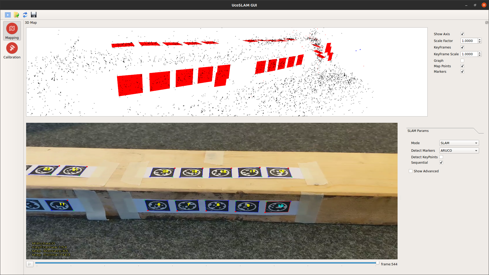

`June 20`
- Replaced 3rd party library [ArUco](https://www.uco.es/investiga/grupos/ava/node/26) to version `3.1.15` to avoid the uglified code in the original repo.
- Added `Stag` in this repo, edited `CMakeLists.txt`, `cmake/dependencies.cmake`, and `cmake/options.cmake` to make it work.

## Note of code
- Markers are detected in `src/utils/frameextractor.cpp`, line 670
```cpp
auto markers=_mdetector->detect(Iinfo.im_org); // Iinfo.im_org is cv::Mat
```
- Marker's attribute (in `src/utils/markerdetector.h`):
```cpp
// unique marker id
uint32_t id;

// three dimentional points of the marker wrt its center
// (This is something like [-0.5 * marker_size, 0.5 * marker_size, 0 ... ])
std::vector<cv::Point3f> points3d;

// original corners in the image
std::vector<cv::Point2f> corners;

// optional info about the marker
// (This attribute is probably not used)
std::string info;
```

## Now it works with STag


- However, the tracking of feature points disappears at some point, not sure why.
    > This problem has been figured out. It's probably because the  vocabulary is no specified. Also, the unconsistency of the marker size may be the reason that cause the distortion.

---

`June 4`
- I tried to used the `-nokeypoints` flag to map the timber, but the program would crash. The solution is to downgrade the UcoSLAM from 1.2.4 to 1.1.0, which is tagged "stable" in the releasing website. However, the result is unpromising (worse than the result with key points).


- Tried with smaller object and slightly bigger tags (2cm vs 2.3cm), works pretty well!


- Debug command
`gdb --args ./ucoslam_monocular '/home/tpp/UCOSlam-IBOIS/result/STag23mm_smallCube/use.mp4' '/home/tpp/UCOSlam-IBOIS/result/calibration_pixel3.yml' '-map' '/home/tpp/UCOSlam-IBOIS/result/STag23mm_smallCube/markers.map' "-aruco-markerSize" "0.023"`

## UcoSLAM 1.2.4 vs 1.1.0
| Function              | 1.2.4 | 1.1.0 |
| --------------------- | :---: | :---: |
| Mapping w/o keypoints |   X   |   O   |
| Mapping w/ keypoints  |   O   | slow  |
| Tracking              |   Yes, but Not w/ GUI   | X    |
> So now, we go back to 1.2.4.
> This table may be wrong :P

- Contrast augmentation is added
    - With augmentation:
      
    - Without augmentation:
      

## Failure
- It lost tracking (the camera position is not recovered) when keypoints are not matching (but marker is detected). This should be fixed.

  

## Remove Tag
- Testing on removing some tags (simulating cutting)

  

## Others
- Done the sticker generation (`stag_util/sticker_generator.py`)
- Post processing now exports an .ply

## Testing with the sticker


## TODO List
- [ ] Enhancement / preprocessing
- [ ] CMake on the main project
- [ ] Rewrite the map post-processing code to C++

## Bugs to deal with
### The lags
- Seems to come out when inconstency introduced in the scene, I guess it's doing optimization on the map.
    - During Mapping
        - ✔️ 2-phase mapping, which reduce this situation, but may still happen
            > Made a python script to do the experiment. This should work.
        - Move the code cause the lag into another thread, and let the main thread keep going => but this probably causes problem
        - This mostly happens when the timber is moved, so
            - Mapping with only the markers: tried, the accuracy is not good
            - Sementic segmentaion which get rid of the background

    - During intance
        - Not updating Map -> lower accuracy
        - Move the code cause the lag into another thread, and let the main thread keep going
        - ✔️ Just cancel it
            > This has been tackled down by adding a system-scale parameter "-isInstancing", which disables the optimization process.

### Bug #1
- This is actually a bug caused by OpenCV. [Link to the issue](https://github.com/opencv/opencv/pull/19253)
- The problem should be solve by upgrading OpenCV to 4.5.5 and setting a flag when calling cv::solvePnPRansac(). This uses another algorithm (USAC), which also performs better than RANSAC. (So actually, we don't have to switch to 5.0.0)
- Available Flags: [Link to the file on Github](https://github.com/opencv/opencv/blob/2a4926f4178681306999cfb04f6de601ec12f47b/modules/calib3d/include/opencv2/calib3d.hpp)
```
//! type of the robust estimation algorithm
enum { LMEDS  = 4,  //!< least-median of squares algorithm
       RANSAC = 8,  //!< RANSAC algorithm
       RHO    = 16, //!< RHO algorithm
       USAC_DEFAULT  = 32, //!< USAC algorithm, default settings
       USAC_PARALLEL = 33, //!< USAC, parallel version
       USAC_FM_8PTS = 34,  //!< USAC, fundamental matrix 8 points
       USAC_FAST = 35,     //!< USAC, fast settings
       USAC_ACCURATE = 36, //!< USAC, accurate settings
       USAC_PROSAC = 37,   //!< USAC, sorted points, runs PROSAC
       USAC_MAGSAC = 38    //!< USAC, runs MAGSAC++
     };
```

``` cpp
  what():  OpenCV(4.2.0) /home/tpp/Downloads/opencv-4.2.0/modules/calib3d/src/calibration.cpp:1171: error: (-2:Unspecified error) in function 'void cvFindExtrinsicCameraParams2(const CvMat*, const CvMat*, const CvMat*, const CvMat*, CvMat*, CvMat*, int)'
> DLT algorithm needs at least 6 points for pose estimation from 3D-2D point correspondences. (expected: 'count >= 6'), where
>     'count' is 5
> must be greater than or equal to
>     '6' is 6

/////////////////////////////////////

10 0x00007ffff7b3b122 in cvFindExtrinsicCameraParams2 () at /usr/local/lib/libopencv_calib3d.so.4.2
#11 0x00007ffff7c5a922 in cv::solvePnPGeneric(cv::_InputArray const&, cv::_InputArray const&, cv::_InputArray const&, cv::_InputArray const&, cv::_OutputArray const&, cv::_OutputArray const&, bool, cv::SolvePnPMethod, cv::_InputArray const&, cv::_InputArray const&, cv::_OutputArray const&)
    () at /usr/local/lib/libopencv_calib3d.so.4.2
#12 0x00007ffff7c5d7d4 in cv::solvePnP(cv::_InputArray const&, cv::_InputArray const&, cv::_InputArray const&, cv::_InputArray const&, cv::_OutputArray const&, cv::_OutputArray const&, bool, int) () at /usr/local/lib/libopencv_calib3d.so.4.2
#13 0x00007ffff7c5f615 in cv::solvePnPRansac(cv::_InputArray const&, cv::_InputArray const&, cv::_InputArray const&, cv::_InputArray const&, cv::_OutputArray const&, cv::_OutputArray const&, bool, int, float, double, cv::_OutputArray const&, int) ()
    at /usr/local/lib/libopencv_calib3d.so.4.2
#14 0x00007ffff7ee0da1 in ucoslam::LoopDetector::_8671179296205241382(ucoslam::Frame&, int) ()
#15 0x00007ffff7ee2280 in ucoslam::LoopDetector::detectLoopFromKeyPoints(ucoslam::Frame&, int) ()
    at /home/tpp/UCOSlam-IBOIS-1.1.0/build/libs/libucoslam.so.1.1
#16 0x00007ffff7f056d6 in ucoslam::MapManager::_12295639104386009589() () at /home/tpp/UCOSlam-IBOIS-1.1.0/build/libs/libucoslam.so.1.1
#17 0x00007ffff7f06900 in ucoslam::MapManager::_8669746328630631075() () at /home/tpp/UCOSlam-IBOIS-1.1.0/build/libs/libucoslam.so.1.1
```

### Bug #2
```cpp
Thread 1 "ucoslam_monocul" received signal SIGSEGV, Segmentation fault.
0x00007ffff7f8c64e in ucoslam::PnPSolver::solvePnp(ucoslam::Frame const&, std::shared_ptr<ucoslam::Map>, std::vector<cv::DMatch, std::allocator<cv::DMatch> >&, ucoslam::se3&, long) () from /home/tpp/UCOSlam-IBOIS-1.1.0/build/libs/libucoslam.so.1.1
(gdb) r
The program being debugged has been started already.
Start it from the beginning? (y or n) n
Program not restarted.
(gdb) backtrace
#0  0x00007ffff7f8c64e in ucoslam::PnPSolver::solvePnp(ucoslam::Frame const&, std::shared_ptr<ucoslam::Map>, std::vector<cv::DMatch, std::allocator<cv::DMatch> >&, ucoslam::se3&, long) () at /home/tpp/UCOSlam-IBOIS-1.1.0/build/libs/libucoslam.so.1.1
#1  0x00007ffff7f16e06 in ucoslam::System::_11166622111371682966(ucoslam::Frame&, ucoslam::se3) ()
    at /home/tpp/UCOSlam-IBOIS-1.1.0/build/libs/libucoslam.so.1.1
#2  0x00007ffff7f1b996 in ucoslam::System::process(ucoslam::Frame const&) () at /home/tpp/UCOSlam-IBOIS-1.1.0/build/libs/libucoslam.so.1.1
#3  0x00007ffff7f1bd45 in ucoslam::System::process(cv::Mat&, ucoslam::ImageParams const&, unsigned int, cv::Mat const&, cv::Mat const&) ()
    at /home/tpp/UCOSlam-IBOIS-1.1.0/build/libs/libucoslam.so.1.1
#4  0x00007ffff7e77960 in ucoslam::UcoSlam::process(cv::Mat&, ucoslam::ImageParams const&, unsigned int) ()
    at /home/tpp/UCOSlam-IBOIS-1.1.0/build/libs/libucoslam.so.1.1
#5  0x0000555555568837 in main ()
```

### Bug #3
- Program stops unexpectedly with no error output, don't know why.
- Mostly happenes during optimization.

## Merge 2 maps
### Input mask
| Map 1 | Map 2 |
| :---: | :---: |
|  |  |
### Merged Result
