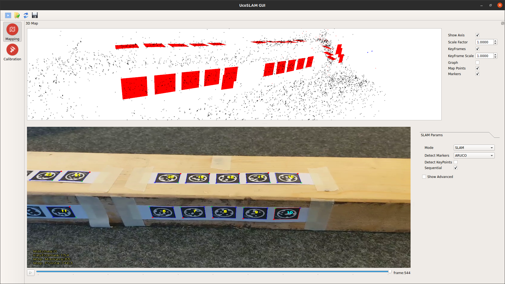

`June 20`
- Replaced 3rd party library [ArUco](https://www.uco.es/investiga/grupos/ava/node/26) to version `3.1.15` to avoid the uglified code in the original repo.
- Added `Stag` in this repo, edited `CMakeLists.txt` to make it work.

## Note of code
- Markers are detected in `src/utils/frameextractor.cpp`, line 670
```cpp
auto markers=_mdetector->detect(Iinfo.im_org); // Iinfo.im_org is cv::Mat
```
- Marker's attribute (in `src/utils/markerdetector.h`):
```cpp
// unique marker id
uint32_t id;

// three dimentional points of the marker wrt its center
// (This is something like [-0.5 * marker_size, 0.5 * marker_size, 0 ... ])
std::vector<cv::Point3f> points3d;

// original corners in the image
std::vector<cv::Point2f> corners;

// optional info about the marker
// (This attribute is probably not used)
std::string info;
```

## Now it works with STag


- However, the tracking of feature points disappears at some point, not sure why.