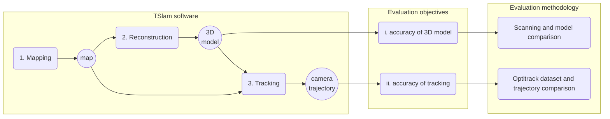

```mermaid
graph LR
    subgraph Evaluation objectives
        A(i. accuracy of 3D model)
        B(ii. accuracy of tracking)
    end

    subgraph TSlam software
      a(1. Mapping)
      b(2. Reconstruction)
      c(3. Tracking)

      z((map))
      k((3D \n model))
      j((camera \n trajectory))

      a --> z
      b --> k
      c --> j

      z --> b
      z --> c
      k --> c
    end

    subgraph Evaluation methodology
      AA(Scanning and model comparison)
      BB(Optitrack dataset and trajectory comparison)

    k --> A
    j --> B

    A --> AA
    B --> BB
  end
```