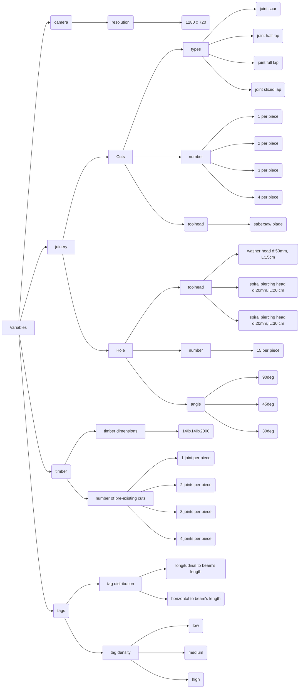

```mermaid
  flowchart LR

    Variables
    Variables --> Cc
    Variables --> J
    Variables --> Ti
    Variables --> T

    %%%%%%%%%%%%%%%%%%%%%%%%%%%%%%%%%%%%%%%%%%%%%%%%%%%%%%%%%%%%%%%%%%%%%%%%%

    Cc(camera)
    Cc --> Ccr(resolution)
    Ccr --> Ccr1(1280 x 720)

    %%%%%%%%%%%%%%%%%%%%%%%%%%%%%%%%%%%%%%%%%%%%%%%%%%%%%%%%%%%%%%%%%%%%%%%%%

    J[joinery]
    J --> Cuts
    J --> Hole

    Cuts[Cuts]
    Cuts --> CutsT
    Cuts --> CutsNum
    Cuts --> CutsTH
    CutsT[types]
    CutsT_S(joint scar)
    CutsT_H(joint half lap)
    CutsT_L(joint full lap)
    CutsT_N(joint sliced lap)
    CutsTH(toolhead)
    CutsTH --> CutsTH_1(sabersaw blade)
    CutsT --> CutsT_S
    CutsT --> CutsT_H
    CutsT --> CutsT_L
    CutsT --> CutsT_N
    CutsNum[number]
    CutsNum --> CutsNum_1(1 per piece)
    CutsNum --> CutsNum_2(2 per piece)
    CutsNum --> CutsNum_3(3 per piece)
    CutsNum --> CutsNum_4(4 per piece)

    Hole[Hole]
    Hole --> HoleT
    Hole --> HoleN
    Hole --> HoleDeg
    HoleT[toolhead]
    HoleT --> HoleT1(washer head d:50mm, L:15cm)
    HoleT --> HoleT2(spiral piercing head d:20mm, L:20 cm)
    HoleT --> HoleT3(spiral piercing head d:20mm, L:30 cm)
    HoleN[number]
    HoleN --> HoleN_10(15 per piece)
    HoleDeg(angle)
    HoleDeg --> HoleDeg_90(90deg)
    HoleDeg --> HoleDeg_45(45deg)
    HoleDeg --> HoleDeg_30(30deg)

    %%%%%%%%%%%%%%%%%%%%%%%%%%%%%%%%%%%%%%%%%%%%%%%%%%%%%%%%%%%%%%%%%%%%%%%%%

    Ti(timber)
    Ti --> Tdim
    Ti --> TNcuts

    Tdim[timber dimensions]
    Tdim --> Td1(140x140x2000)
    TNcuts[timber initial number of cuts]
    
    TNcuts[number of pre-existing cuts]
    TNcuts --> TNcuts_1(1 joint per piece)
    TNcuts --> TNcuts_2(2 joints per piece)
    TNcuts --> TNcuts_3(3 joints per piece)
    TNcuts --> TNcuts_4(4 joints per piece)

    %%%%%%%%%%%%%%%%%%%%%%%%%%%%%%%%%%%%%%%%%%%%%%%%%%%%%%%%%%%%%%%%%%%%%%%%%

    T(tags)
    T --> TDt
    T --> TDd

    TDt[tag distribution]
    TDt --> TDt1(longitudinal to beam's length)
    TDt --> TDt2(horizontal to beam's length)

    TDd[tag density]
    TDd --> TDd1(low)
    TDd --> TDd2(medium)
    TDd --> TDd3(high)
```