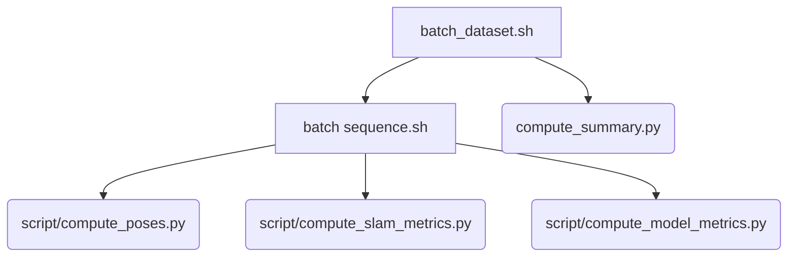

# TSlam evaluation
## TODO:
- add `scripts/compute_model_metrics.py` to `batch_sequence.sh`
- add `scripts/compute_summary.py` to `batch_dataset.sh`

## Run
### Results for the entire dataset
a) it will erase the `dataset/` folder everytime and redownload the dataset.
b) The output can be found in `results/`.
c) If a new version of the dataset is out change the link in the code.
```bash
./batch_dataset.sh
```

### Results for one single sequence
```bash
./batch_sequence.sh -s dataset/01 -e
```
- `-s`: path to the folder sequence
- `-e`: to export videos
- `-t`: to compute only tag mode, otherwise tags only and tags + features


## Source code dependencies
Dependecy for all the scripts in the `eval/` folder.
