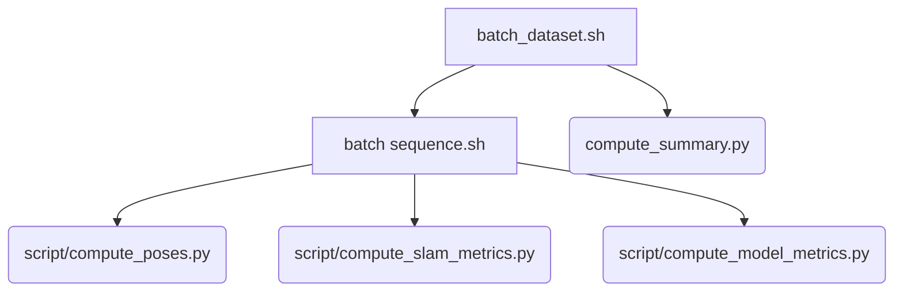

# TSlam evaluation
This folder contains all the necessary files and scripts to reproduce the evaluation of the 

## How to Run
### Before you start
Install the python dependencies in Anaconda and run it from there (see `environment.yml`).

### Results for the entire dataset
a) it will erase the `dataset/` folder everytime and redownload the dataset.
b) The output can be found in `results/`.
c) If a new version of the dataset is out change the link in the code.
```bash
./batch_dataset.sh
```

### Results for one single sequence
```bash
./batch_sequence.sh -s dataset/01 -t
```
- `-s`: path to the folder sequence
- `-e`: to export videos
- `-t`: to compute only tag mode, otherwise tags only and tags + features


### Results for model reconstruction error
```bash
python3 compute_model_metrics.py --data_path /mnt/c/Users/eyang/Desktop/cleaned_pcd_merged --out_path ./test_resul
```
- `--data_path`: root of the dataset path
- `--out_path`: root of the export data

## Source code dependencies
Dependecy for all the scripts in the `eval/` folder.

