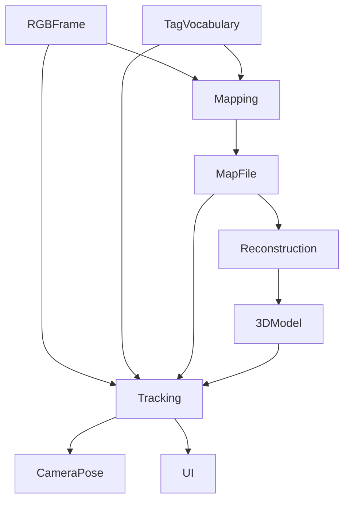

# Evaluation of TSlam
This folder contains all the documents describing the evaluation designed for TSlam.
The TSlam *is an hybrid monocular camera's pose localization algorithm based on both direct feature detection and fiducial markers*.

TSlam is composed by 3 distinct and sequential phases:
- **(1) Mapping**: the piece is first mapped with the camera to obtain a map file of the location of each tags
  - *input*:
    - RGB frame
    - tags' dictionnary file
  - *output*:
    - Map file
- **(2) Reconstruction**: from the obtained map file, a 3d model of the piece is reconstructed
  - *input*:
    - Map file
  - *output*:
    - object 3D model
- **(3) Tracking**: finally the tracking is fed the map file and 3d model mesh. Hence the algorithm can provide the camera's pose when a tag is tracked and visualize the mesh as an overlay on the physical object.
  - *input*:
    - RGB frame
    - Map file
    - tags' dictionnary file
    - object 3D model
  - *output*:
    - camera pose (position and rotation)
    - RGB frame with 3D model visualization as overlay

---
## Experimental Protocol
Here are the different evaluation designed for the TSlam package:

- **(A) Mapping accuracy**:

- **(B) 3D model reconstruction accuracy**: how close is the reconstructed mesh to its GT.
  - *Evaluation set-up*: the evaluation and GT are synthetically generated via Blender. The repository for the generation of the data is [here](https://github.com/ibois-epfl/TSlam-gt-data).
  - *Test population*: 20 timber pieces
  - *Fix params*:
    - `no round shape`: the shapes of the reconstructed objects cannot be round.
    - `no noise`: the tags present no noise (e.g., displaced/inclined planes in the same row).
  - *Varying params*:
    - `timber shape`: we limit the testing to the following shapes and formal characteristics of the objects: (a) box-like objects, (b) skewed objects, (c) length limits of 6 meters MAX and 10 cm min, (d) the number of notch per piece are limited to 2, (e) the type of joinery is limted to the 3 most common joineries (lap-joint, chair-joint, dove-tail)
  - *Data processing*:
  - *Evaluation output*

- **(C) Tracking accuracy**: how close the output TSlam's pose is to its GT. 
  - *Evaluation set-up*: the GT is monitored via the Optitrack system. The code for running the Optitrack capturing is [here](https://github.com/ibois-epfl/aiac-optitrack).
  - *Test population*: 10 timber pieces (two takes per piece as we need to flip sides)
  - *Fix params*:
    - `camera model`: the camera model is [RunCam24K](https://shop.runcam.com/runcam2-4k-edition/). It has a fish-eye's lens which results beneficial since the FOV is enlarged
    - `stationary tracking`: the timber piece will not move during the evaluation. It will be placed in a horizontal position and turned twice to track both sides. Each side will be considered as a separate evaluation session.
    - `timber's shape`: we limit our campaign to subjects representing brand new, off-shelf timber piece and repurposed timber elements presenting irregularities. More precisely we define our population's shapes in two categories: (a) no prior processing, (b) with prior processing of type lap-joints (max. 2 per piece) and/or diagonal ends/elements.
    - `timber's length`: the shape is limited by the tracking area at our disposal of the optitrack, ~3m x 3m. We will choose pieces of ~2.5 m length max.
    - `number and position of tags`: to limit the scope of modalities of which tags could be applied to the piece (in different densities and layouts) we describe and apply the same layout to all elements of the evaluation set. The principle of this layout is trying to cover the largest surface with the minor number of tags and ensure the tags' continuity throughout the timber'faces.
      * *top faces*: a diagonal cross composed of 2 stripes is placed in a fashion to connect the face's corners (fig. 1-A, 2-A)
      * *longitudinal faces*: strips of tags are applied in correspondence of the face's diagonal (fig. 1-B, 2-C). If the face present a notch from a joint, we stop the strip in correspondence of it, and apply a new one (fig. 2-B). We will ensure that there is an overlap between the stripes of ~3 tags.
      
      *Fig.1: example of a timber piece with off-shelf shape*
      
      *Fig.2: example of a timber piece with notches*
  - *Varying params*: None.
  - *Raw data ouput*:
    - [ ] a video sequence of the recording
    - [ ] a video sequence of the recording with overlaid information from the TSlam (e.g., visual widgets of features detected, tag's detected, etc.)
    - [ ] the tranlation and rotation per frame of the optitrack system
    - [ ] the tranlation and rotation per frame of the TSlam
  - *Data processing*: the two sets of pose per frames (from Optitrack and TSlam) are compared between them to estimate the distance between the GT and the TSlam

  - *Evaluation output*

- **(D) Influence of tags on tracking**: how the number and location of tags on the timber piece influence TSlam tracking's stability and accuracy.
  - *Evaluation set-up*:
  - *Test population*:
  - *Fix params*:
  - *Varying params*:
  - *Data processing*:
  - *Evaluation output*

> output density of markers per 10cm2

## List of abbreviations/vocabulary
- **FOV**: field of view of a camera
- **GT**: ground truth
- **synthetic**: data which is computationally generated
- **widget**: a graphical element present in a user interface