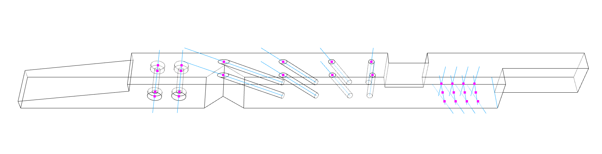
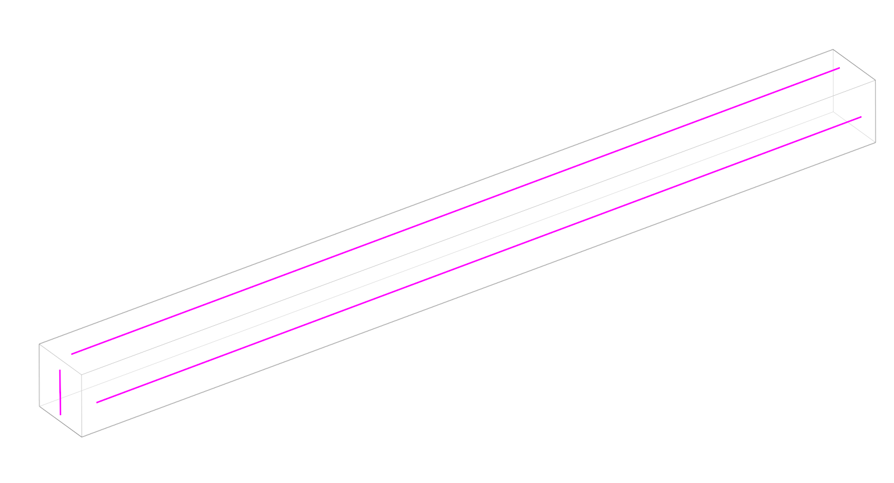
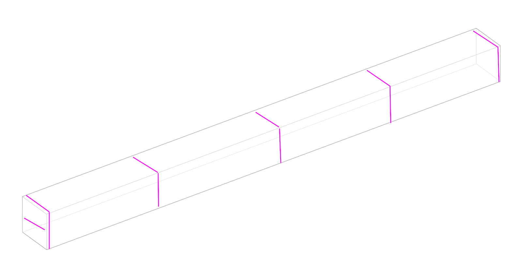
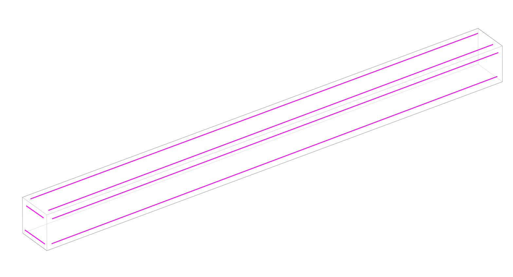
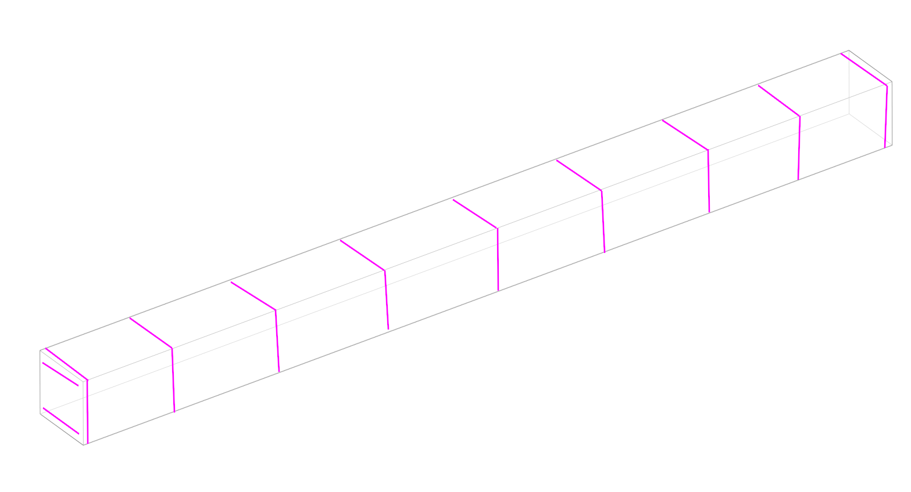
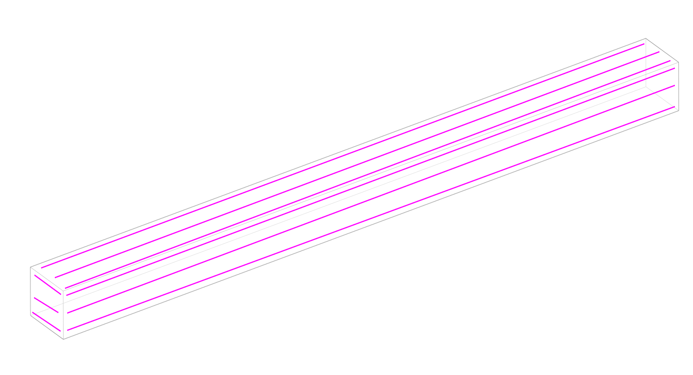
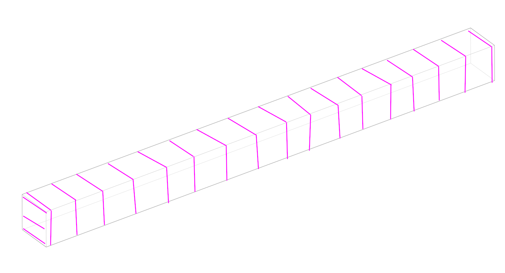

# Evaluation protocol of TSlam

- [Evaluation protocol of TSlam](#evaluation-protocol-of-tslam)
  - [Objectives](#objectives)
  - [Methodology](#methodology)
    - [Evaluation variables and repetitions](#evaluation-variables-and-repetitions)
    - [Evaluation pipeline](#evaluation-pipeline)
      - [(i) Reconstruction](#i-reconstruction)
      - [(ii) Camera trajectory](#ii-camera-trajectory)
    - [Data processing](#data-processing)
      - [(i) Reconstruction](#i-reconstruction-1)
      - [(ii) Camera trajectory](#ii-camera-trajectory-1)
    - [Data analysis (error metrics)](#data-analysis-error-metrics)
      - [(i) TSlam reconstruction](#i-tslam-reconstruction)
      - [(ii) Camera trajectory](#ii-camera-trajectory-2)
  - [General Notes](#general-notes)
  - [Annexe](#annexe)

---
## Objectives
This folder contains all the documents describing the evaluation designed for TSlam.
The TSlam *is an hybrid monocular camera's pose localization algorithm based on both direct feature detection and fiducial markers*.

The scope of the current evaluation protocol is limited to assist the two most important criteria for fabrication in woodworking:
- **i)** the accuracy of the reconstruction model, useful to produce fabrication drawings
- **ii)** the accuracy of the camera to locate itself at runtime during fabrication.

## Methodology
To gauge these metrics, we will test TSlam in multiple real-life scenarios where the user is tasked with the fabrication of popular joineries most commonly used in timber carpentry. During the fabrication sequence, the TSlam will be tested with real-life noises and interferences typical of timber manual fabrication such as chips, vibrations, view obstructions (e.g. from the tool head), rapid movement, extremely close captures, etc.

To evaluate the two enounced evaluation targets we designed an evaluation pipeline identical for each repetition, independently from the experimental parameters identified as worthy of variation. The evaluation pipeline will always outcome the two error target values informing about (**i**) the accuracy of the reconstruction model, and (**ii**) the accuracy of the calculated camera's trajectory.

The first error value (**i**), it will be obtained by comparing the reconstructed model from TSlam and a ground truth model obtained by high-precision laser scanning. For gauging the second goal **(ii)**, we will record the fabrication with an Optitrack system able of recording the ground truth camera's pose per frame. The recorded video during the fabrication will be fed to the TSlam and the computed pose will be calculated. Finally, the TSlam's recorded trajectory and its corresponding ground truth will be evaluated following state-of-the-art SLAM metrics. For term of comparison, the same dataset will be run with a state-of-the-art markless SLAM alternative (ORB-SLAM3) and the results will be compared to TSLAM.

To resume the evaluation design:

   </img>

  <i>Fig.1 - Overview of the objectives and methodology for the evaluation.</i>

---
### Evaluation variables and repetitions
In this chapter we present the variables and fix parameters identified in TSlam. The following scheme defines all the variables. Here's some clarifications on some choices made for selecting determined intervals or defined values for the parameters:

* `fabrication tools`: we will limit the fabrication to the use of a saber saw and drill(with different mesh bits).
* `timber dimensions`: 14x14x200cm. This size is defined by the maximal tracking area of the Optitrack set up. The square session 
* `type of joineries`: we selected 4 of the most famous type of joineries for carpentry (scarf, full, half-, and sliced lap). One for each face so that we need to turn the piece. For holes we want a variation in angles (30-60 deg) and two types of drilling (for washers and pegs/dowels) with 3 different types of the most commonly used mesh bits (spiral mesh bits in two lengths, and a washer mesh bit).
* `distribution and density of tags`: we limit the scope of the use of tags by stripes because we consider this as a plausible use rather than attaching tags one by one. We explore two orientations (long and short axis) and 3 densities.
* `timber shape`: it is worthy of note also that we considered as a variable the initial shape of the timber piece at the beginning of each fabrication session. The timber piece will be processed so that to present either 1,2,3, or 4 joints before the recording session will start. This is not so influential in the evaluation of tracking (**ii**) but rather for evaluating the reconstruction capabilities of TSlam (**i**) of obtaining 3D models of pre-processed and complex geometries (i.e. timber elements presenting irregularities or joineries). Each specimen will present the complete number and types of drilling and cutting joinery (12 holes + 4 joints).

Next, we combined the selected parameters to obtain a combination matrix for the evaluation.

   </img>

  <i>Fig.2 - Scheme of all the variations of parameters selected for the study.</i>

  <i>Fig.3 - Image of all the joineries that will be done on each timber at the end of the repetition. Some timber pieces will present either 1,2,3, or 4 joints before the recorded fabrication session will start to test mainly the 3D reconstruction algorithm of TSlam.</i>

|        stripe distribution           |          ring distribution           |
|:----------------------:|:-----------------------:|
|  |   |
|  |   |
|  |   |

  <i>Fig.4 - Illustrations of the two layouts defined for the evaluation. For each layout we define 3 different level of densities. Tags' distribution and density will impact both the reconstruction (**i**) and tracking (**ii**) accuracy.</i>

<table border="1" class="dataframe">
  <tbody>
    <tr>
      <td>speciment index</td>
      <td>timber dimensions</td>
      <td>cuts itype/number in initial state</td>
      <td>drills type/number to execute</td>
      <td>tags distribution</td>
      <td>tags density</td>
    </tr>
    <tr>
      <td>1</td>
      <td>14x14x2000</td>
      <td>[]</td>
      <td>[10xspiral20, 3xspiral30, 2xwasher]</td>
      <td>stripe layout</td>
      <td>medium density</td>
    </tr>
    <tr>
      <td>2</td>
      <td>14x14x2000</td>
      <td>[]</td>
      <td>[10xspiral20, 3xspiral30, 2xwasher]</td>
      <td>stripe layout</td>
      <td>high density</td>
    </tr>
    <tr>
      <td>3</td>
      <td>14x14x2000</td>
      <td>[]</td>
      <td>[10xspiral20, 3xspiral30, 2xwasher]</td>
      <td>ring layout</td>
      <td>low density</td>
    </tr>
    <tr>
      <td>4</td>
      <td>14x14x2000</td>
      <td>[]</td>
      <td>[10xspiral20, 3xspiral30, 2xwasher]</td>
      <td>ring layout</td>
      <td>medium density</td>
    </tr>
    <tr>
      <td>5</td>
      <td>14x14x2000</td>
      <td>[]</td>
      <td>[10xspiral20, 3xspiral30, 2xwasher]</td>
      <td>ring layout</td>
      <td>high density</td>
    </tr>
    <tr>
      <td>6</td>
      <td>14x14x2000</td>
      <td>[1xscar]</td>
      <td>[10xspiral20, 3xspiral30, 2xwasher]</td>
      <td>stripe layout</td>
      <td>low density</td>
    </tr>
    <tr>
      <td>7</td>
      <td>14x14x2000</td>
      <td>[1xscar]</td>
      <td>[10xspiral20, 3xspiral30, 2xwasher]</td>
      <td>stripe layout</td>
      <td>medium density</td>
    </tr>
    <tr>
      <td>8</td>
      <td>14x14x2000</td>
      <td>[1xscar]</td>
      <td>[10xspiral20, 3xspiral30, 2xwasher]</td>
      <td>stripe layout</td>
      <td>high density</td>
    </tr>
    <tr>
      <td>9</td>
      <td>14x14x2000</td>
      <td>[1xscar]</td>
      <td>[10xspiral20, 3xspiral30, 2xwasher]</td>
      <td>ring layout</td>
      <td>low density</td>
    </tr>
    <tr>
      <td>10</td>
      <td>14x14x2000</td>
      <td>[1xscar]</td>
      <td>[10xspiral20, 3xspiral30, 2xwasher]</td>
      <td>ring layout</td>
      <td>medium density</td>
    </tr>
    <tr>
      <td>11</td>
      <td>14x14x2000</td>
      <td>[1xscar]</td>
      <td>[10xspiral20, 3xspiral30, 2xwasher]</td>
      <td>ring layout</td>
      <td>high density</td>
    </tr>
    <tr>
      <td>12</td>
      <td>14x14x2000</td>
      <td>[1xscar, 1xhalf-lap]</td>
      <td>[10xspiral20, 3xspiral30, 2xwasher]</td>
      <td>stripe layout</td>
      <td>low density</td>
    </tr>
    <tr>
      <td>13</td>
      <td>14x14x2000</td>
      <td>[1xscar, 1xhalf-lap]</td>
      <td>[10xspiral20, 3xspiral30, 2xwasher]</td>
      <td>stripe layout</td>
      <td>medium density</td>
    </tr>
    <tr>
      <td>14</td>
      <td>14x14x2000</td>
      <td>[1xscar, 1xhalf-lap]</td>
      <td>[10xspiral20, 3xspiral30, 2xwasher]</td>
      <td>stripe layout</td>
      <td>high density</td>
    </tr>
    <tr>
      <td>15</td>
      <td>14x14x2000</td>
      <td>[1xscar, 1xhalf-lap]</td>
      <td>[10xspiral20, 3xspiral30, 2xwasher]</td>
      <td>ring layout</td>
      <td>low density</td>
    </tr>
    <tr>
      <td>16</td>
      <td>14x14x2000</td>
      <td>[1xscar, 1xhalf-lap]</td>
      <td>[10xspiral20, 3xspiral30, 2xwasher]</td>
      <td>ring layout</td>
      <td>medium density</td>
    </tr>
    <tr>
      <td>17</td>
      <td>14x14x2000</td>
      <td>[1xscar, 1xhalf-lap]</td>
      <td>[10xspiral20, 3xspiral30, 2xwasher]</td>
      <td>ring layout</td>
      <td>high density</td>
    </tr>
    <tr>
      <td>18</td>
      <td>14x14x2000</td>
      <td>[1xscar, 1xhalf-lap, 1xfull-lap]</td>
      <td>[10xspiral20, 3xspiral30, 2xwasher]</td>
      <td>stripe layout</td>
      <td>low density</td>
    </tr>
    <tr>
      <td>19</td>
      <td>14x14x2000</td>
      <td>[1xscar, 1xhalf-lap, 1xfull-lap]</td>
      <td>[10xspiral20, 3xspiral30, 2xwasher]</td>
      <td>stripe layout</td>
      <td>medium density</td>
    </tr>
    <tr>
      <td>20</td>
      <td>14x14x2000</td>
      <td>[1xscar, 1xhalf-lap, 1xfull-lap]</td>
      <td>[10xspiral20, 3xspiral30, 2xwasher]</td>
      <td>stripe layout</td>
      <td>high density</td>
    </tr>
    <tr>
      <td>21</td>
      <td>14x14x2000</td>
      <td>[1xscar, 1xhalf-lap, 1xfull-lap]</td>
      <td>[10xspiral20, 3xspiral30, 2xwasher]</td>
      <td>ring layout</td>
      <td>low density</td>
    </tr>
    <tr>
      <td>22</td>
      <td>14x14x2000</td>
      <td>[1xscar, 1xhalf-lap, 1xfull-lap]</td>
      <td>[10xspiral20, 3xspiral30, 2xwasher]</td>
      <td>ring layout</td>
      <td>medium density</td>
    </tr>
    <tr>
      <td>23</td>
      <td>14x14x2000</td>
      <td>[1xscar, 1xhalf-lap, 1xfull-lap]</td>
      <td>[10xspiral20, 3xspiral30, 2xwasher]</td>
      <td>ring layout</td>
      <td>high density</td>
    </tr>
    <tr>
      <td>24</td>
      <td>14x14x2000</td>
      <td>[1xscar, 1xhalf-lap, 1xfull-lap, 1xspliced]</td>
      <td>[10xspiral20, 3xspiral30, 2xwasher]</td>
      <td>stripe layout</td>
      <td>low density</td>
    </tr>
    <tr>
      <td>25</td>
      <td>14x14x2000</td>
      <td>[1xscar, 1xhalf-lap, 1xfull-lap, 1xspliced]</td>
      <td>[10xspiral20, 3xspiral30, 2xwasher]</td>
      <td>stripe layout</td>
      <td>medium density</td>
    </tr>
    <tr>
      <td>26</td>
      <td>14x14x2000</td>
      <td>[1xscar, 1xhalf-lap, 1xfull-lap, 1xspliced]</td>
      <td>[10xspiral20, 3xspiral30, 2xwasher]</td>
      <td>stripe layout</td>
      <td>high density</td>
    </tr>
    <tr>
      <td>27</td>
      <td>14x14x2000</td>
      <td>[1xscar, 1xhalf-lap, 1xfull-lap, 1xspliced]</td>
      <td>[10xspiral20, 3xspiral30, 2xwasher]</td>
      <td>ring layout</td>
      <td>low density</td>
    </tr>
    <tr>
      <td>28</td>
      <td>14x14x2000</td>
      <td>[1xscar, 1xhalf-lap, 1xfull-lap, 1xspliced]</td>
      <td>[10xspiral20, 3xspiral30, 2xwasher]</td>
      <td>ring layout</td>
      <td>medium density</td>
    </tr>
    <tr>
      <td>29</td>
      <td>14x14x2000</td>
      <td>[1xscar, 1xhalf-lap, 1xfull-lap, 1xspliced]</td>
      <td>[10xspiral20, 3xspiral30, 2xwasher]</td>
      <td>ring layout</td>
      <td>high density</td>
    </tr>
  </tbody>
</table>

  <i>Fig.5 - Matrix of all possible combinations to test.</i>

---
### Evaluation pipeline
Each. The two outcomes will always be (**i**) the accuracy of the reconstructed model, and the accuracy of the TSlam tracking, i.e. the camera's trajectory (**ii**).

#### (i) Reconstruction
Each timber will be scanned to obtain a point cloud of the object. This will constitute our ground truth model for the reconstruction comparison with the reconstructed model from TSlam. 

#### (ii) Camera trajectory
After the application of the Optitrack and TSlam tracking beacons and the preparation of the necessary set-up for the MotiveOptitrack software to be operative, the beam is mapped with TSlam. The piece will be marked manually as in traditional carpentry practice. The fabrication will be carried out with manual electric tools (saber saw and drill). <u>The operator will not follow any augmented instructions and they will not be provided with any graphical support. The fabrication will be carried out by following the precedently applied marks</u>. This will get rid of any biases in the evaluation of TSlam. If the operator had visual feedback informing them on the TSlam tracking health, they might tend to modify the current wood-working action to ameliorate the visual feedback at their disposal, hence the tracking signal. Our goal for the construction of the dataset is to have a video sequence of common and unbiased woodworking movements. This very sequence will be fed to TSlam and ORBSlam for estimating camera trajectories that will be processed and evaluated in the last section.

   </img>

  <i>Fig.6 - Description of the evaluation pipeline step by step.</i>

---
### Data processing
In this section we go into details of the data processing phase where we collect all the raw data out of the experimental activity, and process it so that it can be used in the next step for the analysis.

#### (i) Reconstruction
After the initial scanning for each timber piece, we have a ground truth point cloud ($Pcd_{gt}$) and the mesh from TSlam(`Mesh_ts`). To compare the two in the next phase we need to process the data in two steps:
- we first obtain a point cloud of the mesh by sampling the mesh into a point cloud($Pcd_{ts}$)
- next we align the two point clouds by finding the rigid RANSAC registration that defines the transformation $T_{reg}$ to apply to $Pcd_{ts}$ which becomes $Pcd_{ts}^i$, the error of the transformation is measured in *fitness* and *RMSE* of inlier points between the two clouds.

The total output processed data is the following:
- $Pcd_{gt}$: the scan point cloud of the timber piece
- $Pcd_{ts}^i$: the registered sampled point cloud from the tslam reconstructed 3D model

#### (ii) Camera trajectory
After the Optitrack tracking of the fabrication we obtain the following data:
- $T_t$: the transformation records from the Optitrack of the timber rigid body (translation + quaternions) expressed in a global coordinate system
- $T_r$: the transformation records from the Optitrack of the camera rigid body (translation + quaternions) expressed in a global coordinate system
- $f_{RGB}$: frames of the fabrication video sequence

Next, the TSlam runs on the recorded video sequence and output the following data:
- $T_s$: the transformation records from the TSLAM of the camera (translation + quaternions) expressed in the coordinate system of the timber piece (the object is fix and the camera moves around)
- $f_{RGB}^{overlay}$: the RGB frames with visual hints of markers or visual features detections

Now, in order to compare the two trajectories we need to do 3 operations:
- **(1)** *object-related frame system transposal for ground truth trajectory*: express $T_r$ in the coordinate of $T_t$ to obtain a new list of transformations named $T_c$. This will be our ground truth and it is necessary to have both $T_c$ and $T_s$ on the same timber beam's coordinate system.
- **(2)** *trajectory alignment for absolute trajectory error (**ATE**)*: now that the two sets of trajectories ($T_c$ and $T_s$) are expressed in the same local system we need to align them with the Horn transform[^1]. This will align $T_s$ to $T_c$ to obtain $T_{sa}$. We will do the same for the ORBSlam $T_o$ to $T_r$ to obtain a rigid transformation to apply to $T_o$ to obtain $T_{oa}$. For the ATE the transformation is made on the entirety of the trajectories.
- **(3)** *selection of intervals in trajectories and local alignement (**RE**)*: for the second type of metric, the relative one, we need to select the fabrication intervals (when cutting or drilling). The same intervals are locally aligned following the method by Zhang et al.[^2]. We apply this step to both the TSlam ($T_s$) and ORBSlam ($T_o$) trajectories with target the GT trajectory ($T_c$ for $T_s$ and $T_r$ for $T_o$) to obtain an ensemble of aligned sequences for TSlam, $A_{Tsr}$, and for ORBSlam, $A_{Tor}$

   </img>

  <i>Fig.7 - Two different alignement (and error distance calculation) for the ATE and RE. Ref: https://rpg.ifi.uzh.ch/docs/IROS18_Zhang.pdf</i>

The total output processed data is the following:
- $T_r$: the trajectory of the ground truth camera from the Optitrack recording expressed in global coordinates
- $T_c$: the ground truth trajectory expressed in the timber beam's coordinate system
- $T_{sa}$: the TSlam trajectory aligned to $T_c$
- $T_{oa}$: the ORBSlam trajectory aaligned to $T_r$
- $A_{Tsr}$: set of sub-sequences of TSlam trajectory alligned to $T_c$ corresponding sequences
- $A_{Tor}$: set of sub-sequences of ORBSLAM trajectory alligned to $T_r$ corresponding sequences
- $f_{RGB}$: video capture of the fabrication sequence
- $f_{RGB}^{overlay}$: video capture of the fabrication sequence with tslam graphical info overlay

With these processed data we are able to proceed to the next phase: the data analysis.

[^1]: the Horn transformation for trajectories' alignement: B. K. P. Horn, “Closed-form solution of absolute orientation using unit quaternions,” Journal of the Optical Society of America A, vol. 4, no. 4, p. 629, Apr. 1987. [Online]. Available: https://doi.org/10.1364/josaa.4.000629.

[^2]: tutorial on evaluation of trajectories: Z. Zhang and D. Scaramuzza, “A tutorial on quantitative trajectory evaluation for visual(-inertial) odometry,” in 2018 IEEE/RSJ International Conference on Intelligent Robots and Systems (IROS), 2018, pp. 7244–7251. [Online]. Available: https://github.com/uzh-rpg/rpg_trajectory_evaluation.

---
### Data analysis (error metrics)
In this section we run analysis on the processed data to obtain the final evaluation results for (**i**) quantifying the error of the reconstructed algorithm, (**ii**) and the distance between the TSlam computed trajectory and the ground-truth trajectory, the ORBSlam and the ground-truth trajectory, and a comparison of the two errors for the two SLAM systems.

#### (i) TSlam reconstruction
The evaluation of the accuracy of the reconstructed method is expressed by the hausdorff distance.

#### (ii) Camera trajectory
For both TSlam and ORBSLAM3 we compare the trajectories with the ground truth and espress the error as the distance between two trajectories. We consider two error distances:
- **AET**: absolute error distance on the entire trajectory for each component of translation and rotation. This is done both for the TSlam and ORBSlam
- **RE**: the relative error distance on the selected sub-trajectories corresponding to the cutting/drilling sequences for each component of translation and rotation. This is done both for the TSlam and ORBSlam.
- *error comparison between TSlam and ORBSlam*: we will compare the two eror sets from the TSlam and ORBSlam to qunatify the efficenc of TSlam over open-sourced markless state-of-the-art slam methods existing today.

At the end of the error estimation, these are the error values we obtain,
for the ATE:
- $ATE^{tslam}_{transX}$: the absolute trajectory error for the translation X component of TSlam
- $ATE^{tslam}_{transY}$: the absolute trajectory error for the translation Y component of TSlam
- $ATE^{tslam}_{transZ}$: the absolute trajectory error for the translation Z component of TSlam
- $ATE^{tslam}_{rotX}$: the absolute rotation error for the translation X component of TSlam
- $ATE^{tslam}_{rotY}$: the absolute rotation error for the translation X component of TSlam
- $ATE^{tslam}_{rotZ}$: the absolute rotation error for the translation X component of TSlam
- $ATE^{orbslam}_{transX}$: the absolute trajectory error for the translation X component of ORBSLAM3
- $ATE^{orbslam}_{transY}$: the absolute trajectory error for the translation Y component of ORBSLAM3
- $ATE^{orbslam}_{transZ}$: the absolute trajectory error for the translation Z component of ORBSLAM3
- $ATE^{orbslam}_{rotX}$: the absolute rotation error for the translation X component of ORBSLAM3
- $ATE^{orbslam}_{rotY}$: the absolute rotation error for the translation X component of ORBSLAM3
- $ATE^{orbslam}_{rotZ}$: the absolute rotation error for the translation X component of ORBSLAM3

and for the RE:
- $RE^{tslam}_{transX}$: the ensemble of the absolute trajectory errors for the translation X component of TSlam
- $RE^{tslam}_{transY}$: the ensemble of the absolute trajectory errors for the translation Y component of TSlam
- $RE^{tslam}_{transZ}$: the ensemble of the absolute trajectory errors for the translation Z component of TSlam
- $RE^{tslam}_{rotX}$: the ensemble of the absolute rotation errors for the translation X component of TSlam
- $RE^{tslam}_{rotY}$: the ensemble of the absolute rotation errors for the translation X component of TSlam
- $RE^{tslam}_{rotZ}$: the ensemble of the absolute rotation errors for the translation X component of TSlam
- $RE^{orbslam}_{transX}$: the ensemble of the absolute trajectory errors for the translation X component of ORBSLAM3
- $RE^{orbslam}_{transY}$: the ensemble of the absolute trajectory errors for the translation Y component of ORBSLAM3
- $RE^{orbslam}_{transZ}$: the ensemble of the absolute trajectory errors for the translation Z component of ORBSLAM3
- $RE^{orbslam}_{rotX}$: the ensemble of the absolute rotation errors for the translation X component of ORBSLAM3
- $RE^{orbslam}_{rotY}$: the ensemble of the absolute rotation errors for the translation X component of ORBSLAM3
- $RE^{orbslam}_{rotZ}$: the ensemble of the absolute rotation errors for the translation X component of ORBSLAM3

Finally we will express the errors difference betwen TSlam and ORBSLAM across in ATE and RE as two mean values.

The data will be graphically represented as follow:

- *the drifting of tslam in translation and orientation for the ATE*: for both the error values of TSlam and ORBSLAM3.

   </img>

  <i>Fig.8 - Draft illustration for drifting values for ATE. Both ORBSLAM and TSLAM will be in the same. Ref: https://rpg.ifi.uzh.ch/docs/IROS18_Zhang.pdf</i>

- *boxplots for the translation and rotation error for each sequence RE*: for both the error values of TSlam and ORBSLAM3.

   </img>

  <i>Fig.9 - Draft illustration for box plot RE for each trajectory sequence: error values of TSlam and ORBSLAM3 will be integrated in the same graph. REf: https://rpg.ifi.uzh.ch/docs/IROS18_Zhang.pdf</i>

## General Notes
The evaluation protocol is designed to assess parameters that are important for the fabrication process. As every other SLAM, also TSlam could be evaluated under many other aspects and criteria proper to the computer vision domain. Nevertheless, we limit the evaluation to the obtention of quantitative data only for those parameters impacting operational aspects of the developed SLAM pipeline. We will mention all relevant state-of-the-art evaluation methods and will make public the collected data and source code for further computer-vision fundamental analysis on TSlam.

## Annexe
- planning for TSLAM working package
- most relevant state of the art on evaluation of SLAM algorithms
- the "ordre de commande" for the  needed timber for the experience