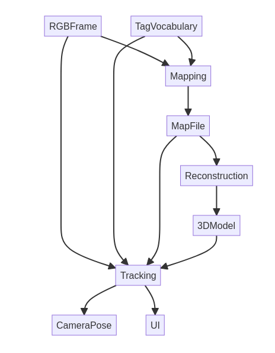
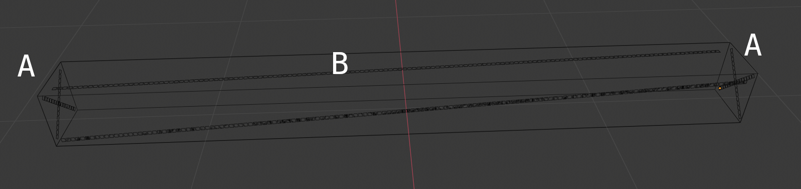
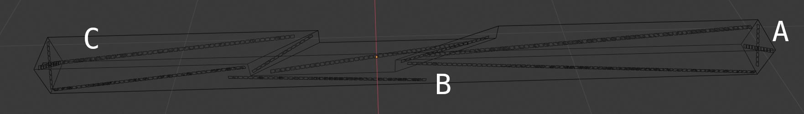
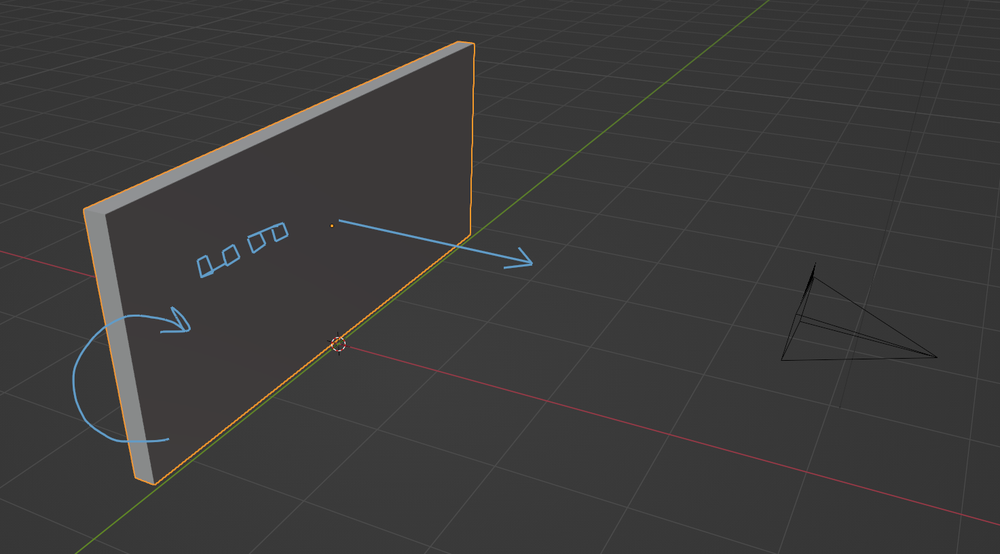
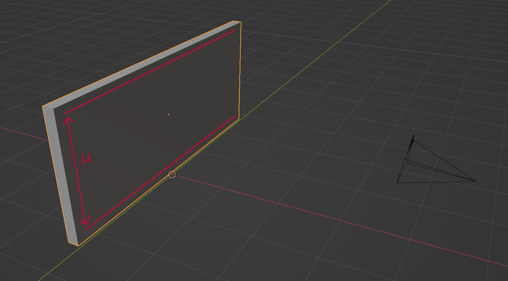
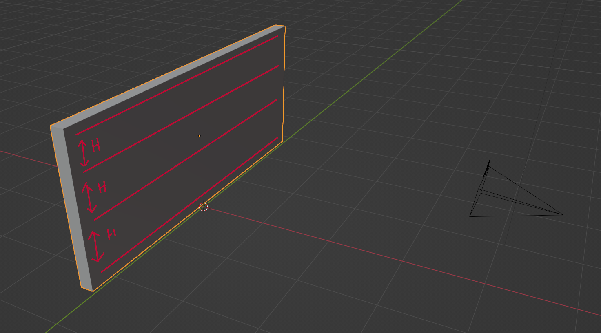

# Evaluation of TSlam
This folder contains all the documents describing the evaluation designed for TSlam.
The TSlam *is an hybrid monocular camera's pose localization algorithm based on both direct feature detection and fiducial markers*.

TSlam is composed by 3 distinct and sequential phases:
- **(1) Mapping**: the piece is first mapped with the camera to obtain a map file of the location of each tags
  - *input*:
    - RGB frame
    - tags' dictionnary file
  - *output*:
    - Map file
- **(2) Reconstruction**: from the obtained map file, a 3d model of the piece is reconstructed
  - *input*:
    - Map file
  - *output*:
    - object 3D model
- **(3) Tracking**: finally the tracking is fed the map file and 3d model mesh. Hence the algorithm can provide the camera's pose when a tag is tracked and visualize the mesh as an overlay on the physical object.
  - *input*:
    - RGB frame
    - Map file
    - tags' dictionnary file
    - object 3D model
  - *output*:
    - camera pose (position and rotation)
    - RGB frame with 3D model visualization as overlay

<!--  -->

## State-of-the-art on evaluating SLAM
SLAM are often evaluated on pre-existing data sets such as the KITTI dataset. Since we use specific tags (RTags) and pipeline for the TSlam to be used we need to define our own evaluation pipeline.

---
## Experimental Protocol
Here are the different evaluations designed for the TSlam package. They are all designed following this layout:

>- **(#) name**:
>  - *Evaluation set-up*: equipement or environment of the evaluation.
>  - *Test population*: number of evaluation samples.
>  - *Fix params*: parameters that have been blocked in variations to restrain the scope of the evaluation.
>  - *Varying params*: parameters subjected to variation
>  - *Uncontrolled params*: parameters that remain uncontrolled because cannot be fixed or limited. They represent the flaws of the design.
>  - *Raw data output*: the measured data without processing.
>  - *Data processing*: the data processing methodology.
>  - *Evaluation output*: the final outcomes of the evaluation.

- **(A) Mapping accuracy**: undefined
  - *Evaluation set-up*:
  - *Test population*:
  - *Fix params*:
  - *Varying params*:
  - *Uncontrolled params*:
  - *Data processing*:
  - *Evaluation output*:

- **(B) 3D model reconstruction accuracy**: how close is the reconstructed mesh to its GT.
  - *Evaluation set-up*: the evaluation and GT are synthetically generated via Blender. The repository for the generation of the data is [here](https://github.com/ibois-epfl/TSlam-gt-data).
  - *Test population*: 20 timber pieces
  - *Fix params*:
    - `no round shape`: the shapes of the reconstructed objects cannot be round.
    - `no noise`: the tags present no noise (e.g., displaced/inclined planes in the same row).
    - `number and position of tags`: to limit the scope of modalities of which tags could be applied to the piece (in different densities and layouts) we describe and apply the same layout to all elements of the evaluation set. The principle of this layout is trying to cover the largest surface with the minor number of tags and ensure the tags' continuity throughout the timber'faces.
  - *Varying params*:
    - `timber shape`: we limit the testing to the following shapes and formal characteristics of the objects: (a) box-like objects, (b) skewed objects, (c) length limits of 6 meters MAX and 10 cm min, (d) the number of notch per piece are limited to 2, (e) the type of joinery is limted to the 3 most common joineries (lap-joint, chair-joint, dove-tail)
  - *Uncontrolled params*:
  - *Raw data output*: 
    - [ ] the synthetic Map for each 3D object
    - [ ] a GT mesh for each 3D object
  - *Data processing*: we compare vertex-by-vertex euclidian distance error between the reconstructed object and its corresponding GT model to obtain a mean error distance per model.
  - *Evaluation output*:
    - [ ] plot showing mean error and error boundaries for each piece (axisX: timber element id, axisY: error scale)
    - [ ] an unique mean error value across all elements

- **(C) Tracking accuracy**: how close the output TSlam's pose is to its GT. 
  - *Evaluation set-up*: the GT is monitored via the Optitrack system. The code for running the Optitrack capturing is [here](https://github.com/ibois-epfl/aiac-optitrack).
  - *Test population*: 10 timber pieces (two takes per piece as we need to flip sides)
  - *Fix params*:
    - `video length`: for each element the video must have a fix number of frames
    - `camera model`: the camera model is [RunCam24K](https://shop.runcam.com/runcam2-4k-edition/). It has a fish-eye's lens which results beneficial since the FOV is enlarged
    - `stationary tracking`: the timber piece will not move during the evaluation. It will be placed in a horizontal position and turned twice to track both sides. Each side will be considered as a separate evaluation session.
    - `timber's shape`: we limit our campaign to subjects representing brand new, off-shelf timber piece and repurposed timber elements presenting irregularities. More precisely we define our population's shapes in two categories: (a) no prior processing, (b) with prior processing of type lap-joints (max. 2 per piece) and/or diagonal ends/elements.
    - `timber's length`: the shape is limited by the tracking area at our disposal of the optitrack, ~3m x 3m. We will choose pieces of ~2.5 m length max.
    - `number and position of tags`: to limit the scope of modalities of which tags could be applied to the piece (in different densities and layouts) we describe and apply the same layout to all elements of the evaluation set. The principle of this layout is trying to cover the largest surface with the minor number of tags and ensure the tags' continuity throughout the timber'faces.
      * *top faces*: a diagonal cross composed of 2 stripes is placed in a fashion to connect the face's corners (fig. 1-A, 2-A)
      * *longitudinal faces*: strips of tags are applied in correspondence of the face's diagonal (fig. 1-B, 2-C). If the face presents a notch from a joint, we stop the strip in correspondence of it, and apply a new one (fig. 2-B). We will ensure that there is an overlap between the stripes of ~3 tags.
      
      *Fig.1: example of a timber piece with off-shelf shape*
      
      *Fig.2: example of a timber piece with notches*
  - *Varying params*: None.
  - *Uncontrolled params*:
      - `camera path`: the camera is held by a user that goes around the piece until the video is over by alternating close shots (distance from the surface ~5cm) to wide shots (distance from the surface ~30cm).
  - *Raw data output*:
    - [ ] a video sequence of the recording
    - [ ] a video sequence of the recording with overlaid information from the TSlam (e.g., visual widgets of features detected, tag's detected, etc.)
    - [ ] the tranlation and rotation per frame of the optitrack system
    - [ ] the tranlation and rotation per frame of the TSlam
    - [ ] a binary value per frame if TSlam is tracking or not
  - *Data processing*: 
    - [ ] *per set*: the two sets of pose per frames (from Optitrack and TSlam) are compared per frame to estimate the distance value between the GT and the TSlam for each value of the two poses (i.e. posX, posY, posZ, rotX, rotY, rotZ, rotW).
    - [ ] *across all sets*: the mean distance per each pose's values
  - *Evaluation output*:
    - [ ] .csv file of the distance and overhaul mean distance pose's value for each timber piece (i.e. posX, posY, posZ, rotX, rotY, rotZ, rotW)
    - [ ] .txt file with the overhaul mean distance among all poses'values (i.e. posX, posY, posZ, rotX, rotY, rotZ, rotW)
    - [ ] plot with 6 (3 TSlam + 3 corresponding GT) graph for visualizing translation error mean (axisX: translation error scale, axisY: frames, color1: TSlam value mean, color2: GT value mean)
    - [ ] plot with 8 (4 TSlam + 4 corresponding GT) graph for visualizing rotation error (axisX: rotation error scale, axisY: frames, color1: TSlam value mean, color2: GT value mean)
    - [ ] (annexe) graphs showing the translation and rotation error per each timber

- **(D) Influence of tags on tracking**: how the number and location of tags on the timber piece influence TSlam tracking's stability and accuracy. The objective is to estimate the correct distribution of tags to have a stable tracking. The layout of the tags is not evaluated but it will be deducted as heuristic once conclusions are drawn from this evaluation package.
  - *Evaluation set-up*: the experimental set-up is composed by a camera fix in position and rotation. A timber plate is moved in position and changed in rotation and present tags attached to its face.
  
  - *Test population*: multiple sets depending on the varying parameters.
  - *Fix params*:
    - `capture length`: fix number of frames.
    - `camera model`: the camera model is [RunCam24K](https://shop.runcam.com/runcam2-4k-edition/).
    - `stationary camera`: the camera is in fix position.
    - `timber shape`: the shape is fixed to a single planar face.
    - `timber dimension`: the dimension of the timber piece will fit the camera view from the farest distance (e.g. ~50cm x 70cm).
    - `tags strips`: we will use tags in strips because this is the obvious choice operationally and pratically to stick these markers to any piece (i.e. no singular tags will be placed).
  - *Varying params*:
    <!-- - `number of tags`: -->
    - `view inclination`: the inclination of the timber piece can range from 0 deg to 90 deg with steps of 10 deg.
    - `view distance`: the view distance can range from ~50cm to ~5cm with steps of 10cm.
    <!-- - `density of tags (ratio tags/surface)`:  -->
    - `distribution of tags (spatial pattern)`: the number of stripes and the distance between them can vary. See figure 2 as an example.
    
     
    
    | Test1    |     Test2     | Test3 |
    |----------|:-------------:|------:|
    |  |  |  |

  - *Uncontrolled params*: None
  - *Raw data output*: binary data per take if the TSlam outputs a pose or not.
  - *Data processing*: None.
  - *Evaluation output*:
    - [ ] a 3D scatter plot which represent the dots as the successfull detection depending on the varying parameters (aixsZ: angles, axisY: distance from camera, axisX: tag distribution type). The distribution that counts the more success is theoretically the optimal one. Results will be discussed with practical considerations to find the best balance between a reasonable tags to be used in production and good tracking.

## List of abbreviations/vocabulary
- **FOV**: field of view of a camera
- **GT**: ground truth
- **synthetic**: data which is computationally generated
- **widget**: a graphical element present in a user interface