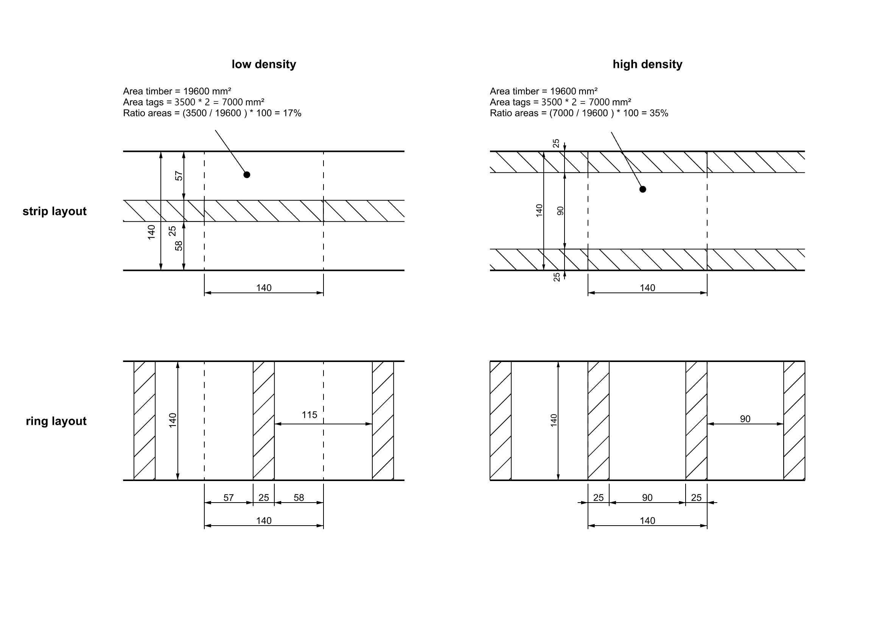

# procedures notes

## instructions protocol
- [ ] start the recording for the manual marking
- [ ] manual marking
- [ ] stop and start recording
- [ ] make preliminary cuts
- [ ] start the recording for the tslam tags
- [ ] apply tslam tags
- [ ] stop and save recording for the tslam tags
- [ ] scan the piece and export raw point clouds of the two halves
- [ ] save pointclouzds

- [ ] start video recording for tslam mapping
- [ ] start tslam mapping console app:
  ```bash
    ./tslam_monocular live:0 '/home/tpp/TSlam/assets/calibrationf/calibration_orange_A_1280_720_r.yml' -voc '/home/tpp/TSlam/assets/voc/orb.fbow' -out /home/tpp/TSlam/temp/01/01_opti_map -outvideo /home/tpp/TSlam/temp/01/01_mapping.mp4`
  ```
- [ ] stop tslam mapping and save map
- [ ] reconstruct the mesh
- [ ] save files on tslam
- [ ] stop and save video recording for tslam mapping

- [ ] (if beginning of day) run optitrack masking + calibration
- [ ] apply optitrack markers beacons on timber piece
- [ ] change rigid bodies (timber index=1, camera index=2) + refine

- [ ] start video recording fabrication
- [ ] launch optitrack recording + camera
- [ ] fabricate
- [ ] close and save optitrack recording + camera
- [ ] end and save video recording fabrication


# Notes

## optitrack recording
It's important to set up the Z-axis in the `View > Data Streaming Pane` in  for the axis direction value `Up Axis`.
The capture format of the images is 1920x1080 (96 dpi) and it's captured at 30 FPS.
The output of the stream is in `data\recordings` a `.csv` and is structured this way:
| frame_number | timestamp_frame_in_secs | timber_pos_x | timber_pos_y | timber_pos_z | timber_rot_x | timber_rot_y | timber_rot_z | timber_rot_w | camera_pos_x | camera_pos_y | camera_pos_z | camera_rot_x | camera_rot_y | camera_rot_z | camera_rot_w |
| ------ | ------ | ------ | ------ | ------ | ------ | ------ | ------ | ------ | ------ | ------ | ------ | ------ | ------ | ------ | ------ |
e.g.:
```
4;1.7925961017608643;0.10815107077360153;0.9061020612716675;0.11638563126325607;0.0016159965889528394;-0.9996160268783569;0.004494452849030495;0.027296336367726326;-0.30383992195129395;0.9318215847015381;0.5460047721862793;-0.5904256701469421;-0.18119165301322937;0.18444201350212097;-0.7645576000213623
```
It the rotation is expressed in Z-up axis system (right-hand format).

## camera recording
The top camera is used to document the runtime but especially to time:
- the application of markers on the timber piece
- the mapping of the timber piece with tslam

The script is in `util\camera\record.py`:
```terminal
options:
  -h, --help            show this help message and exit
  -n NAME, --name NAME  Set the name of the session. (default: no_name)
  -f FPS, --fps FPS     Set the fps value. (default: 3)
  -c CAMERA, --camera CAMERA
                        Set the camera index. (default: 0)
  -o OUTPUTDIR, --outputdir OUTPUTDIR
                        Set the output dir name. In the output dir you will find: + frames named by index + .csv with time stamps in seconds per
                        frame + .txt file with the total time of the recording + .avi recording of the sequence. (default: )

Example: python record.py -n beam_12 -f 15 -c 0 -o custom_dir
```

## Repetitions

<table border="1" class="dataframe">
  <tbody>
    <tr>
      <td>specimen index</td>
      <td>timber dimensions [cm]</td>
      <td>cuts type/number in initial state</td>
      <td>cuts type/number in final state</td>
      <td>drills type/number to execute</td>
      <td>tags distribution</td>
      <td>tags density</td>
    </tr>
    <tr>
      <td>1</td>
      <td>14x14x200</td>
      <td>[]</td>
      <td>[1xscar, 1xhalf-lap, 1xfull-lap, 1xspliced, 2xspliced-45]</td>
      <td>[18xspiralShort20, 2xspiralLong25, 2xspiralOblique356xwasher50, 8xscrews120, 8xscrews100, 8xscrews80, 8xscrews45]</td>
      <td>stripe layout</td>
      <td>low density</td>
    </tr>
    <tr>
      <td>2</td>
      <td>14x14x200</td>
      <td>[]</td>
      <td>[1xscar, 1xhalf-lap, 1xfull-lap, 1xspliced, 2xspliced-45]</td>
      <td>[18xspiralShort20, 2xspiralLong25, 2xspiralOblique356xwasher50, 8xscrews120, 8xscrews100, 8xscrews80, 8xscrews45]</td>
      <td>stripe layout</td>
      <td>medium density</td>
    </tr>
    <tr>
      <td>3</td>
      <td>14x14x200</td>
      <td>[]</td>
      <td>[1xscar, 1xhalf-lap, 1xfull-lap, 1xspliced, 2xspliced-45]</td>
      <td>[18xspiralShort20, 2xspiralLong25, 2xspiralOblique356xwasher50, 8xscrews120, 8xscrews100, 8xscrews80, 8xscrews45]</td>
      <td>ring layout</td>
      <td>low density</td>
    </tr>
    <tr>
      <td>4</td>
      <td>14x14x200</td>
      <td>[]</td>
      <td>[1xscar, 1xhalf-lap, 1xfull-lap, 1xspliced, 2xspliced-45]</td>
      <td>[18xspiralShort20, 2xspiralLong25, 2xspiralOblique356xwasher50, 8xscrews120, 8xscrews100, 8xscrews80, 8xscrews45]</td>
      <td>ring layout</td>
      <td>medium density</td>
    </tr>
    <tr>
      <td>5</td>
      <td>14x14x200</td>
      <td>[1xscar]</td>
      <td>[1xscar, 1xhalf-lap, 1xfull-lap, 1xspliced, 2xspliced-45]</td>
      <td>[18xspiralShort20, 2xspiralLong25, 2xspiralOblique356xwasher50, 8xscrews120, 8xscrews100, 8xscrews80, 8xscrews45]</td>
      <td>stripe layout</td>
      <td>low density</td>
    </tr>
    <tr>
      <td>6</td>
      <td>14x14x200</td>
      <td>[1xscar]</td>
      <td>[1xscar, 1xhalf-lap, 1xfull-lap, 1xspliced, 2xspliced-45]</td>
      <td>[18xspiralShort20, 2xspiralLong25, 2xspiralOblique356xwasher50, 8xscrews120, 8xscrews100, 8xscrews80, 8xscrews45]</td>
      <td>stripe layout</td>
      <td>medium density</td>
    </tr>
    <tr>
      <td>7</td>
      <td>14x14x200</td>
      <td>[1xscar]</td>
      <td>[1xscar, 1xhalf-lap, 1xfull-lap, 1xspliced, 2xspliced-45]</td>
      <td>[18xspiralShort20, 2xspiralLong25, 2xspiralOblique356xwasher50, 8xscrews120, 8xscrews100, 8xscrews80, 8xscrews45]</td>
      <td>ring layout</td>
      <td>low density</td>
    </tr>
    <tr>
      <td>8</td>
      <td>14x14x200</td>
      <td>[1xscar]</td>
      <td>[1xscar, 1xhalf-lap, 1xfull-lap, 1xspliced, 2xspliced-45]</td>
      <td>[18xspiralShort20, 2xspiralLong25, 2xspiralOblique356xwasher50, 8xscrews120, 8xscrews100, 8xscrews80, 8xscrews45]</td>
      <td>ring layout</td>
      <td>medium density</td>
    </tr>
    <tr>
      <td>9</td>
      <td>14x14x200</td>
      <td>[1xscar, 1xhalf-lap]</td>
      <td>[1xscar, 1xhalf-lap, 1xfull-lap, 1xspliced, 2xspliced-45]</td>
      <td>[18xspiralShort20, 2xspiralLong25, 2xspiralOblique356xwasher50, 8xscrews120, 8xscrews100, 8xscrews80, 8xscrews45]</td>
      <td>stripe layout</td>
      <td>low density</td>
    </tr>
    <tr>
      <td>10</td>
      <td>14x14x200</td>
      <td>[1xscar, 1xhalf-lap]</td>
      <td>[1xscar, 1xhalf-lap, 1xfull-lap, 1xspliced, 2xspliced-45]</td>
      <td>[18xspiralShort20, 2xspiralLong25, 2xspiralOblique356xwasher50, 8xscrews120, 8xscrews100, 8xscrews80, 8xscrews45]</td>
      <td>stripe layout</td>
      <td>medium density</td>
    </tr>
    <tr>
      <td>11</td>
      <td>14x14x200</td>
      <td>[1xscar, 1xhalf-lap]</td>
      <td>[1xscar, 1xhalf-lap, 1xfull-lap, 1xspliced, 2xspliced-45]</td>
      <td>[18xspiralShort20, 2xspiralLong25, 2xspiralOblique356xwasher50, 8xscrews120, 8xscrews100, 8xscrews80, 8xscrews45]</td>
      <td>ring layout</td>
      <td>low density</td>
    </tr>
    <tr>
      <td>12</td>
      <td>14x14x200</td>
      <td>[1xscar, 1xhalf-lap]</td>
      <td>[1xscar, 1xhalf-lap, 1xfull-lap, 1xspliced, 2xspliced-45]</td>
      <td>[18xspiralShort20, 2xspiralLong25, 2xspiralOblique356xwasher50, 8xscrews120, 8xscrews100, 8xscrews80, 8xscrews45]</td>
      <td>ring layout</td>
      <td>medium density</td>
    </tr>
    <tr>
      <td>13</td>
      <td>14x14x200</td>
      <td>[1xscar, 1xhalf-lap, 1xfull-lap]</td>
      <td>[1xscar, 1xhalf-lap, 1xfull-lap, 1xspliced, 2xspliced-45]</td>
      <td>[18xspiralShort20, 2xspiralLong25, 2xspiralOblique356xwasher50, 8xscrews120, 8xscrews100, 8xscrews80, 8xscrews45]</td>
      <td>stripe layout</td>
      <td>low density</td>
    </tr>
    <tr>
      <td>14</td>
      <td>14x14x200</td>
      <td>[1xscar, 1xhalf-lap, 1xfull-lap]</td>
      <td>[1xscar, 1xhalf-lap, 1xfull-lap, 1xspliced, 2xspliced-45]</td>
      <td>[18xspiralShort20, 2xspiralLong25, 2xspiralOblique356xwasher50, 8xscrews120, 8xscrews100, 8xscrews80, 8xscrews45]</td>
      <td>stripe layout</td>
      <td>medium density</td>
    </tr>
    <tr>
      <td>15</td>
      <td>14x14x200</td>
      <td>[1xscar, 1xhalf-lap, 1xfull-lap]</td>
      <td>[1xscar, 1xhalf-lap, 1xfull-lap, 1xspliced, 2xspliced-45]</td>
      <td>[18xspiralShort20, 2xspiralLong25, 2xspiralOblique356xwasher50, 8xscrews120, 8xscrews100, 8xscrews80, 8xscrews45]</td>
      <td>ring layout</td>
      <td>low density</td>
    </tr>
    <tr>
      <td>16</td>
      <td>14x14x200</td>
      <td>[1xscar, 1xhalf-lap, 1xfull-lap]</td>
      <td>[1xscar, 1xhalf-lap, 1xfull-lap, 1xspliced, 2xspliced-45]</td>
      <td>[18xspiralShort20, 2xspiralLong25, 2xspiralOblique356xwasher50, 8xscrews120, 8xscrews100, 8xscrews80, 8xscrews45]</td>
      <td>ring layout</td>
      <td>medium density</td>
    </tr>
    <tr>
      <td>17</td>
      <td>14x14x200</td>
      <td>[1xscar, 1xhalf-lap, 1xfull-lap, 1xspliced]</td>
      <td>[1xscar, 1xhalf-lap, 1xfull-lap, 1xspliced, 2xspliced-45]</td>
      <td>[18xspiralShort20, 2xspiralLong25, 2xspiralOblique356xwasher50, 8xscrews120, 8xscrews100, 8xscrews80, 8xscrews45]</td>
      <td>stripe layout</td>
      <td>low density</td>
    </tr>
    <tr>
      <td>18</td>
      <td>14x14x200</td>
      <td>[1xscar, 1xhalf-lap, 1xfull-lap, 1xspliced]</td>
      <td>[1xscar, 1xhalf-lap, 1xfull-lap, 1xspliced, 2xspliced-45]</td>
      <td>[18xspiralShort20, 2xspiralLong25, 2xspiralOblique356xwasher50, 8xscrews120, 8xscrews100, 8xscrews80, 8xscrews45]</td>
      <td>stripe layout</td>
      <td>medium density</td>
    </tr>
    <tr>
      <td>19</td>
      <td>14x14x200</td>
      <td>[1xscar, 1xhalf-lap, 1xfull-lap, 1xspliced]</td>
      <td>[1xscar, 1xhalf-lap, 1xfull-lap, 1xspliced, 2xspliced-45]</td>
      <td>[18xspiralShort20, 2xspiralLong25, 2xspiralOblique356xwasher50, 8xscrews120, 8xscrews100, 8xscrews80, 8xscrews45]</td>
      <td>ring layout</td>
      <td>low density</td>
    </tr>
    <tr>
      <td>20</td>
      <td>14x14x200</td>
      <td>[1xscar, 1xhalf-lap, 1xfull-lap, 1xspliced]</td>
      <td>[1xscar, 1xhalf-lap, 1xfull-lap, 1xspliced, 2xspliced-45]</td>
      <td>[18xspiralShort20, 2xspiralLong25, 2xspiralOblique356xwasher50, 8xscrews120, 8xscrews100, 8xscrews80, 8xscrews45]</td>
      <td>ring layout</td>
      <td>medium density</td>
    </tr>
  </tbody>
</table>

## Markers density

The following image resumes the chosen densities and layout for the mark densities.

