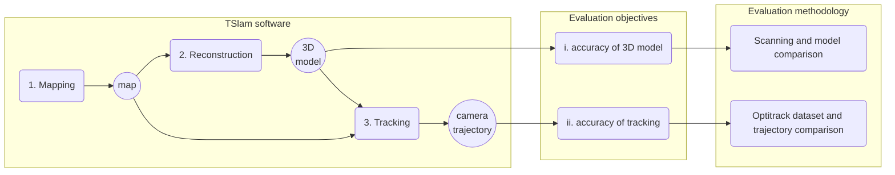
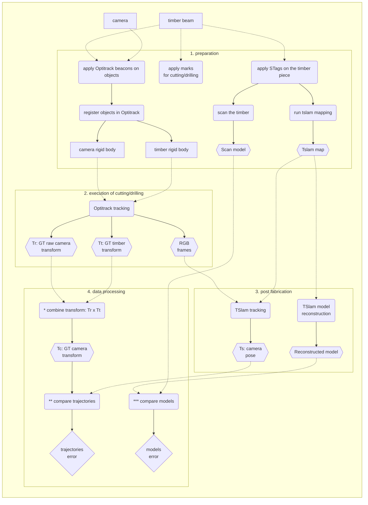

# Evaluation protocol of TSlam

- [Evaluation protocol of TSlam](#evaluation-protocol-of-tslam)
  - [Objectives](#objectives)
  - [Methodology](#methodology)
    - [Evaluation variables and repetitions](#evaluation-variables-and-repetitions)
    - [Evaluation pipeline](#evaluation-pipeline)
    - [Data processing](#data-processing)
      - [(i) TSlam reconstruction](#i-tslam-reconstruction)
      - [(ii) Camera trajectories](#ii-camera-trajectories)
    - [Data analysis (error metrics)](#data-analysis-error-metrics)
      - [(i) TSlam reconstruction](#i-tslam-reconstruction-1)
      - [(ii) Camera trajectories](#ii-camera-trajectories-1)
  - [General Notes](#general-notes)
  - [Questions](#questions)

---
## Objectives
This folder contains all the documents describing the evaluation designed for TSlam.
The TSlam *is an hybrid monocular camera's pose localization algorithm based on both direct feature detection and fiducial markers*.

The scope of the current evaluation protocol is limited to assest the two most important criteria for fabrication in wood working:
- **i)** the accuracy of the reconstruction model, useful to produce fabrication drawings
- **ii)** the accuracy of the camera to locate itself at runtime during fabrication.

## Methodology
To gauge these metrics, we will test TSlam in multiple real-life scenarios where the user is tasked with the fabrication of popular joineries most commonly used in timber carpentry. During the fabrication sequence, the TSlam will be tested with real-life noises and interferences typical of timber manual fabrication such as chips, vibrations, view obstructions (e.g. from the tool head), rapid movement, extremely close captures, etc.

To evaluate the two enounced evaluation targets we designed an evaluation pipeline identical for each repetition, independently from the experimental parameters identified as worthy of variation. The evaluation pipeline will always outcome the two error target values informing about (**i**) the accuracy of the reconstruction model, and (**ii**) the accuracy of the calculated camera's trajectory.

The first error value (**i**), it will be obtained by comparing the reconstructed model from TSlam and a ground truth model obtained by high-precision laser scanning. For gauging the second goal **(ii)**, we will record the fabrication with an Optitrack system able of recording the ground truth camera's pose per frame. The recorded video during the fabrication will be fed to the TSlam and the computed pose will be calculated. Finally, the TSlam's recorded trajectory and its corresponding ground truth will be evaluated following state-of-the-art SLAM metrics.

To resume the evaluation design:

---
### Evaluation variables and repetitions

* (A) timber length: 14x14cm length 2m (defined by the optitrack capture area): 18 pieces in total

* (B) Same cuts and holes on each beam with the most popular types of joineries for carpentry. One for each phase so that we need to turn the piece. For holes we want a variation in angles (30-60 deg) and two types of drilling (for washers and pegs/dowels).

* (C) the distribution and density of tags. We limit the scope of the use of tags by stripes because we identify this as a plausible use rather than single ones. We explore two orientations (long and short axis) and 3 densities.

|        stripe distribution           |          ring distribution           |
|:----------------------:|:-----------------------:|
|  |   |
|  |   |
|  |   |

---
### Evaluation pipeline

The evaluation pipeline for each iteration and it is independent from the values of the evaluation parameters. The two outcomes will always be (**i**) the accuracy of the reconstructed model, and the accuracy of the TSlam tracking, i.e. the camera's trajectory (**ii**).

- **i**) <u>the reconstruction needs to be clarified</u>
- **ii**) after the application of the Optitrack and TSlam tracking beacons and the preparation of the necessary set-up for the MotiveOptitrack software to be operative, the beam is mapped with TSlam. The piece will be marked manually as in traditional carpentry practice. The fabrication will be carried out with manual electric tools (saber saw and drill). <u>The operator will not follow any augmented instructions and they will not be provided with any graphical support. The fabrication will be carried out by following the precedently applied marks</u>. This will get rid of any biases in the evaluation of TSlam. in fact, if the operator had visual feedback informing them on the TSlam tracking health, they might have the tendancy of modifying the current wood-working action to ameliorate the visual feedback at their disposal, hence the tracking signal. Our goal for the construction of the dataset is to have a video sequence of common and unbiased wood-working movements.

---

### Data processing
In this section we go into details of the data processing phase where we collect all the raw data out of the experimental activity, process it transform the data so that can be used in the next step for the analysis.

#### (i) TSlam reconstruction
THIS NEEDS TO BE DEFINED

#### (ii) Camera trajectories
After the Optitrack tracking of the fabrication we obtain the following data:
- `Tt`: the transformation records from the Optitrack of the timber rigid body (translation + quaternions) expressed in a global coordinate system
- `Tr`: the transformation records from the Optitrack of the camera rigid body (translation + quaternions) expressed in a global coordinate system
- `RGB frames`: frames of the fabrication video sequence
`
Next, the TSlam runs on the recorded video sequence and output the following data:
- `Ts`: the transformation records from the TSLAM of the camera (translation + quaternions) expressed in the coordinate system of the timber piece (the object is fix and the camera moves around)
- `RGB frames with detection overlay`: the RGB frames with visual hints of markers or visual features detections

Now, in order to compare the two trajectories we need to do 2 operations:
- **(1)** *object-related frame system transposal*: express `Tr` in the coordinate of `Tt` to obtain a new list of transformations named `Tc`. This will be our ground truth and it is necessary to have both `Tc` and `Ts` on the same timber beam's coordinate system.

---->>>> the allignements depending on Absolute Trajectory Error(ATE) or relative (RE) <<<<<<------
<!-- - **(2)** *trajectory alignement*: now that the two sets of transformations (`Tc` and `Ts`) are expressed in the same local system we need to align them with the Horn transform[^1]. This will align `Ts` to `Tc` to obtain `Tsa`.

After these two steps we obtain the following processed data:
- `Tc`: the ground truth transformations expressed in the timber beam's coordinate system
- `Tsa`: the TSlam transformations aligned to `Tc`
- `RGB frames`: video capture of the fabrication sequence

With these 3 data we are able to proceed to the next phase: the data analysis.

[^1]: the Horn transformation for trajectories' alignement: B. K. P. Horn, “Closed-form solution of absolute orientation using unit quaternions,” Journal of the Optical Society of America A, vol. 4, no. 4, p. 629, Apr. 1987. [Online]. Available: https://doi.org/10.1364/josaa.4.000629 -->

---
### Data analysis (error metrics)
In this section we run analysis on the processed data to obtain the final evaluation results for (**i**) quantifying the error of the reconstructed algorithm, (**ii**) and the distance between the TSlam computed trajectory and the ground-truth trajectory.

#### (i) TSlam reconstruction
THIS NEEDS TO BE DEFINED

#### (ii) Camera trajectories
To compare the two trajectories, state-of-the-art SLAM evaluations propose

https://github.com/uzh-rpg/rpg_trajectory_evaluation

## General Notes
The evaluation protocol is designed to assess parameters that are important for the fabrication process. As every other SLAM, also TSlam could be evaluated under many other aspects and criteria proper to the computer vision domain. Nevertheless, we limit the evaluation to the obtention of quantitative data only for those parameters impacting operational aspects of the developed SLAM pipeline. We will mention all relevant state-of-the-art evaluation methods and will make public the collected data and source code for further computer-vision fundamental analysis on TSlam.

## Questions
- [ ] if we use all the same identical beam there is no interest in testing the same shape for the reconstruction. What if we do a synthetic evaluation easier, rather than comparing a point cloud with all the referencing and meshing problems. Since it seems to be seperate.