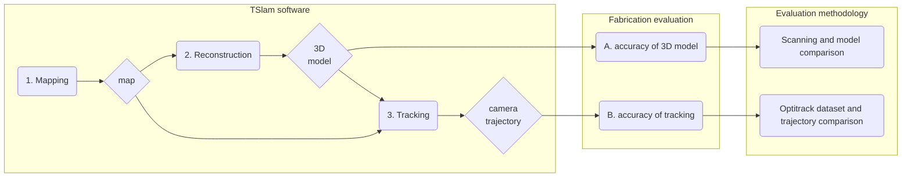

# Evaluation of TSlam

---
## Detailed planning and working packages

---
## Evaluation protocol
### Objectives
This folder contains all the documents describing the evaluation designed for TSlam.
The TSlam *is an hybrid monocular camera's pose localization algorithm based on both direct feature detection and fiducial markers*.

The scope of the current evaluation protocol is limited to assest the two most important criteria for fabrication in wood working:
- **(a)** the accuracy of the reconstruction model to produce the fabrication drawings
- **(b)** the accuracy of the camera to locate itself at runtime during fabrication.

### Methodology
To gauge these metrics, we will test TSlam in multiple real-life scenarios where the user is tasked with the fabrication of popular joineries most commonly used in timber carpentry. During the fabrication sequence, the TSlam will be tested with real-life noises and interferences typical of timber manual fabrication such as chips, vibrations, view's obstructions (e.g. from the tool head), rapid movement, extremely close captures, etc.
To evaluate the two enounced evaluation targets, we will: for **(a)** obtain a scan of the reconstructed piece and compare it to the reconstructed model from SLAM, with it we will produce a fabrication model and visualize it at runtime during a fabrication sequence. For gauging the second goal **(b)**, we will record the fabrication with an Optitrack system able of recording the ground truth camera's pose per frame. Finally, the TSlam's recorded trajectory and its corresponding ground truth will be evaluated following state-of-the-art SLAM metrics (e.g. average relative translation (ART), and average relative rotation (ARR), or absolute trajectory error (ATE)).

To resume the evaluation methodology:

