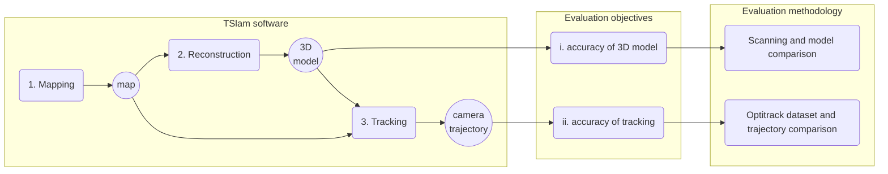
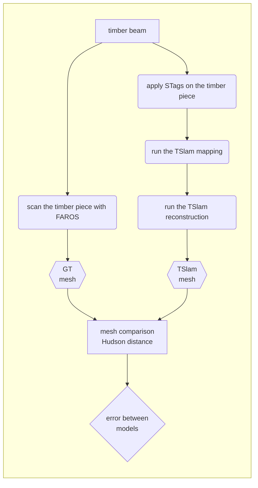
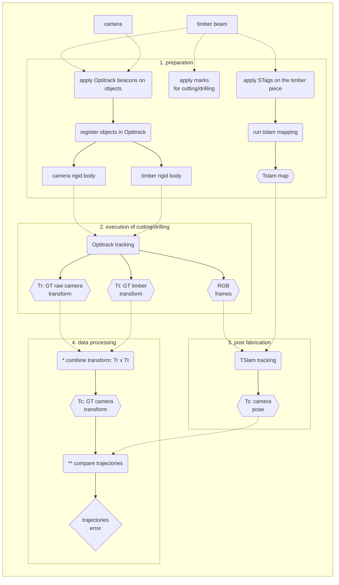

# Evaluation protocol of TSlam

- [Evaluation protocol of TSlam](#evaluation-protocol-of-tslam)
  - [Objectives](#objectives)
  - [Methodology](#methodology)
    - [i - Evaluation of the 3d model](#i---evaluation-of-the-3d-model)
      - [Variables](#variables)
      - [Step-by-step overview](#step-by-step-overview)
    - [ii - Evaluation of the camera trajectory](#ii---evaluation-of-the-camera-trajectory)
      - [Variables](#variables-1)
      - [Step-by-step overview](#step-by-step-overview-1)
  - [General Notes](#general-notes)

---
## Objectives
This folder contains all the documents describing the evaluation designed for TSlam.
The TSlam *is an hybrid monocular camera's pose localization algorithm based on both direct feature detection and fiducial markers*.

The scope of the current evaluation protocol is limited to assest the two most important criteria for fabrication in wood working:
- **i)** the accuracy of the reconstruction model to produce the fabrication drawings
- **ii)** the accuracy of the camera to locate itself at runtime during fabrication.

## Methodology
To gauge these metrics, we will test TSlam in multiple real-life scenarios where the user is tasked with the fabrication of popular joineries most commonly used in timber carpentry. During the fabrication sequence, the TSlam will be tested with real-life noises and interferences typical of timber manual fabrication such as chips, vibrations, view obstructions (e.g. from the tool head), rapid movement, extremely close captures, etc.

To evaluate the two enounced evaluation targets, we will: for **(i)** obtain a scan of the reconstructed piece and compare it to the reconstructed model from SLAM. For gauging the second goal **(ii)**, we will record the fabrication with an Optitrack system able of recording the ground truth camera's pose per each frame. The recorded video will be fed to the TSlam and the computed pose will be calculated. Finally, the TSlam's recorded trajectory and its corresponding ground truth will be evaluated following state-of-the-art SLAM metrics (e.g. average relative translation (ART), and average relative rotation (ARR), or absolute trajectory error (ATE)).

To resume the evaluation design:

In the following two chapters we are going to describe in details the modalities of evaluation for the first and second objectives of the protocol.s

---
### i - Evaluation of the 3d model
intro
#### Variables

#### Step-by-step overview

---
### ii - Evaluation of the camera trajectory
intro

(*) to be able to compare the Optitrack ground truth for the camera pose with the TSlam we need to apply the Optitrack transformation recorded for the timber to the Optitrack camera. The objective is to bring the camera pose expressed in a global coordinate system, to the timber's coordinate system as in the TSlam.

(**) the trajectories will be first put back to the same coordinate system with the Horn transform. Next, we consider only the values in which the tracking is active and compare the absolute
trajectory error (ATE, rotation + translation).

#### Variables

#### Step-by-step overview

## General Notes
The evaluation protocol is designed to assess parameters that are important for the fabrication process. As every other SLAM, also TSlam could be evaluated under many other aspects and criteria proper to the computer vision domain. Nevertheless, we limit the evaluation to the obtention of quantitative data only for those parameters impacting operational aspects of the developed SLAM pipeline. We will mention all relevant state-of-the-art evaluation methods and will make public the collected data and source code for further computer-vision fundamental analysis on TSlam.