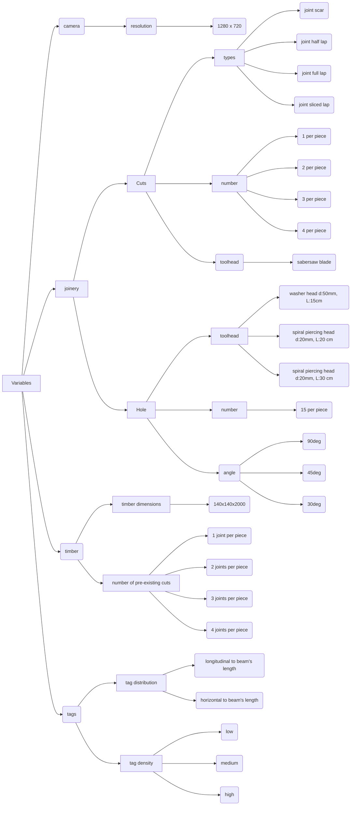

```mermaid
graph LR

    %% styling
    subG_prep:::subGStylI
    %% classDef subGStylI padding-left:30em fill:#f9f;
    %% classDef subGStylII padding-left:30em;

    subG_prefab ==> 
    subG_prep ==>
    subG_exec ==>
    subG_post ==>
    subG_data ==>
    subG_analysis

    O[timber beam]
    OO[camera]
    O -.-> optPrep1
    O -.-> mark
    OO -.-> optPrep1

    subgraph subG_prefab[0. pre-fabrication]
      mark(apply marks \n for cutting/drilling)
      mark --> prefab(make cuts \n before fabrication)

    end

    subgraph subG_prep[1. preparation]
      optPrep1(apply Optitrack beacons on objects)
      optPrep2(register objects in Optitrack)
      optPrep1 --> optPrep2

      rigidB1[camera rigid body]
      rigidB2[timber rigid body]
      optPrep2 --> rigidB1
      optPrep2 --> rigidB2

      prefab -.-> tslamPr1(apply STags on the timber piece)
      
      tslamPr2(run tslam mapping)
      tslamPr1 --> tslamPr2
      tslamPrR{{Tslam map}}
      tslamPr2 --> tslamPrR

      scan(scan the timber)
      tslamPr1 --> scan
      scanR{{Scan model}}
      scan --> scanR
    end


    subgraph subG_exec[2. recorded fabrication]
      opti1(Optitrack tracking)
      rigidB1 -.-> opti1
      rigidB2 -.-> opti1
      optR1{{RGB \n frames}}
      optR2{{Tr: GT raw camera \n transform}}
      optR3{{Tt: GT timber \n transform}}
      opti1 --> optR1
      opti1 --> optR2
      opti1 --> optR3
    end


    subgraph subG_post[3. post fabrication]
      tslam1(TSlam tracking)
      optR1 -.-> tslam1
      tslamPrR -.-> tslam1
      tslamR1{{Ts: camera \n pose}}
      tslam1 --> tslamR1

      ORBSLAM3(ORBSLAM3 tracking)
      ORBSLAM3 --> ORBSLAM3_R1{{To: camera pose}}

      tslam2(TSlam model \n reconstruction)
      tslamPrR -.-> tslam2
      tslamR2{{Reconstructed model}}
      tslam2 --> tslamR2
    end


    subgraph subG_data[4. data processing]
      proc1(combine transform: Tr x Tt)
      optR2 -.-> proc1
      optR3 -.-> proc1
      procR1{{Tc: GT camera \n trajectory}}
      proc1 --> procR1
      procR1 --> proc2

      proc1_orb(combine transform: Tr x To)
      optR2 -.-> proc1_orb
      ORBSLAM3_R1 -.-> proc1_orb
      proc1_orbR1{{Tc: ORBSLAM3 camera \n trajectory}}
      proc1_orb --> proc1_orbR1
      proc1_orbR1 --> proc2
      tslamR1 -.-> proc2
      
      proc2(allign trajectories)
      proc2 --> proc2ATE(realligned \n entire trajectory)
      proc2 --> proc2RE(realligned only \n fabrication sequences)
      proc2ATE --> Ts_ar_gt{{Ts_ar_gt: TSlam \n trajectory alligned to GT}}
      proc2RE --> Ts_rr_gt{{Ts_rr_gt: TSlam trajectory \n sequences alligned to GT}}
      proc2ATE --> To_ar_gt{{To_ar_gt: TSlam \n trajectory alligned to GT}}
      proc2RE --> To_rr_gt{{To_rr_gt: TSlam trajectory \n sequences alligned to GT}}

    end

    subgraph subG_analysis[5, data anlysis]
      %%%%%%%%%%%%%% trajectory errors %%%%%%%%%%%%%%
      compareT_ATE_TSLAM_GT(compare absolute trajectory \n error TSlam/GT)
      Ts_ar_gt -.-> compareT_ATE_TSLAM_GT
      procR1 -.-> compareT_ATE_TSLAM_GT

      compareT_RE_TSLAM_GT(compare relative trajectory \n errors TSlam/GT)
      Ts_rr_gt -.-> compareT_RE_TSLAM_GT
      procR1 -.-> compareT_RE_TSLAM_GT

      compareT_ATE_ORBSLAM_GT(compare absolute trajectory \n error ORBSLAM/GT)
      To_ar_gt -.-> compareT_ATE_ORBSLAM_GT
      procR1 -.-> compareT_ATE_ORBSLAM_GT

      compareT_RE_ORBSLAM_GT(compare relative trajectory \n errors ORBSLAM/GT)
      To_rr_gt -.-> compareT_RE_ORBSLAM_GT
      procR1 -.-> compareT_RE_ORBSLAM_GT


      compareT_ATE_TSLAM_GT_R1_A(GT/Tslam error \n absolute error)
      compareT_ATE_TSLAM_GT --> compareT_ATE_TSLAM_GT_R1_A

      compareT_ATE_R2_A(GT/ORBSLAM3 error \n absolute error)
      compareT_ATE --> compareT_ATE_R2_A

      compareT_RE_R1_R(GT/Tslam error \n relative error)
      compareT_RE --> compareT_RE_R1_R

      compareT_RE_R2_R(GT/ORBSLAM3 error \n relative error)
      compareT_RE --> compareT_RE_R2_R

      %%%%%%%%%%%%%% reconstruction errors %%%%%%%%%%%%%%
      compareM(compare models)
      tslamR2-.-> compareM
      scanR-.-> compareM
      compareMR1(models \n error)
      compareM --> compareMR1
    end

```

# TODOs

- [ ] draw 3d rhino of piece and define location, dimensions and number of holes
- [ ] prepare detailed planning for evaluation
- [ ] write to Anna for help cutting
- [ ] finish protocol for data processing and analysis
- [ ] add chapter predictions
- [ ] prepare ppt presentation
- [ ] adapt chapter methodology
- [ ] read state of the art for model comparison

# Evaluation protocol of TSlam

- [TODOs](#todos)
- [Evaluation protocol of TSlam](#evaluation-protocol-of-tslam)
  - [Objectives](#objectives)
  - [Methodology](#methodology)
    - [Evaluation variables and repetitions](#evaluation-variables-and-repetitions)
    - [Evaluation pipeline](#evaluation-pipeline)
      - [(i) Reconstruction](#i-reconstruction)
      - [(ii) Camera trajectory](#ii-camera-trajectory)
    - [Data processing](#data-processing)
      - [(i) Reconstruction](#i-reconstruction-1)
      - [(ii) Camera trajectory](#ii-camera-trajectory-1)
    - [Data analysis (error metrics)](#data-analysis-error-metrics)
      - [(i) TSlam reconstruction](#i-tslam-reconstruction)
      - [(ii) Camera trajectory](#ii-camera-trajectory-2)
  - [General Notes](#general-notes)
  - [Questions](#questions)

---
## Objectives
This folder contains all the documents describing the evaluation designed for TSlam.
The TSlam *is an hybrid monocular camera's pose localization algorithm based on both direct feature detection and fiducial markers*.

The scope of the current evaluation protocol is limited to assist the two most important criteria for fabrication in woodworking:
- **i)** the accuracy of the reconstruction model, useful to produce fabrication drawings
- **ii)** the accuracy of the camera to locate itself at runtime during fabrication.

## Methodology
To gauge these metrics, we will test TSlam in multiple real-life scenarios where the user is tasked with the fabrication of popular joineries most commonly used in timber carpentry. During the fabrication sequence, the TSlam will be tested with real-life noises and interferences typical of timber manual fabrication such as chips, vibrations, view obstructions (e.g. from the tool head), rapid movement, extremely close captures, etc.

To evaluate the two enounced evaluation targets we designed an evaluation pipeline identical for each repetition, independently from the experimental parameters identified as worthy of variation. The evaluation pipeline will always outcome the two error target values informing about (**i**) the accuracy of the reconstruction model, and (**ii**) the accuracy of the calculated camera's trajectory.

The first error value (**i**), it will be obtained by comparing the reconstructed model from TSlam and a ground truth model obtained by high-precision laser scanning. For gauging the second goal **(ii)**, we will record the fabrication with an Optitrack system able of recording the ground truth camera's pose per frame. The recorded video during the fabrication will be fed to the TSlam and the computed pose will be calculated. Finally, the TSlam's recorded trajectory and its corresponding ground truth will be evaluated following state-of-the-art SLAM metrics. For term of comparison, the same dataset will be run with a state-of-the-art markless SLAM alternative (ORB-SLAM3) and the results will be compared to TSLAM.

To resume the evaluation design:

---
### Evaluation variables and repetitions
In this chapter we present the variables and fix parameters identified in TSlam. The following scheme defines all the variables. Here's some clarifications on some choices made for selecting determined intervals or defined values for the parameters:

* `fabrication tools`: we will limit the fabrication to the use of a saber saw and drill(with different mesh bits).
* `timber dimensions`: 14x14x200cm. This size is defined by the maximal tracking area of the Optitrack set up. The square session 
* `type of joineries`: we selected 4 of the most famous type of joineries for carpentry (scarf, full, half-, and sliced lap). One for each face so that we need to turn the piece. For holes we want a variation in angles (30-60 deg) and two types of drilling (for washers and pegs/dowels) with 3 different types of the most commonly used mesh bits (spiral mesh bits in two lengths, and a washer mesh bit).
* `distribution and density of tags`: we limit the scope of the use of tags by stripes because we consider this as a plausible use rather than attaching tags one by one. We explore two orientations (long and short axis) and 3 densities.
* `timber shape`: it is worthy of note also that we considered as a variable the initial shape of the timber piece at the beginning of each fabrication session. The timber piece will be processed so that to present either 1,2,3, or 4 joints before the recording session will start. This is not so influential in the evaluation of tracking (**ii**) but rather for evaluating the reconstruction capabilities of TSlam (**i**) of obtaining 3D models of pre-processed and complex geometries (i.e. timber elements presenting irregularities or joineries). Each specimen will present the complete number and types of drilling and cutting joinery (12 holes + 4 joints).

Next, we combined the selected parameters to obtain a combination matrix for the evaluation.

  <i>Fig.# - Scheme of all the variations of parameters selected for the study.</i>

  <i>Fig.# - Image of all the joineries that will be done on each timber at the end of the repetition. Some timber pieces will present either 1,2,3, or 4 joints before the recorded fabrication session will start to test mainly the 3D reconstruction algorithm of TSlam.</i>

|        stripe distribution           |          ring distribution           |
|:----------------------:|:-----------------------:|
|  |   |
|  |   |
|  |   |

  <i>Fig.# - Illustrations of the two layouts defined for the evaluation. For each layout we define 3 different level of densities. Tags' distribution and density will impact both the reconstruction (**i**) and tracking (**ii**) accuracy.</i>

<table border="1" class="dataframe">
  <tbody>
    <tr>
      <td>speciment index</td>
      <td>timber dimensions</td>
      <td>cuts itype/number in initial state</td>
      <td>drills type/number to execute</td>
      <td>tags distribution</td>
      <td>tags density</td>
    </tr>
    <tr>
      <td>1</td>
      <td>14x14x2000</td>
      <td>[]</td>
      <td>[10xspiral20, 3xspiral30, 2xwasher]</td>
      <td>stripe layout</td>
      <td>medium density</td>
    </tr>
    <tr>
      <td>2</td>
      <td>14x14x2000</td>
      <td>[]</td>
      <td>[10xspiral20, 3xspiral30, 2xwasher]</td>
      <td>stripe layout</td>
      <td>high density</td>
    </tr>
    <tr>
      <td>3</td>
      <td>14x14x2000</td>
      <td>[]</td>
      <td>[10xspiral20, 3xspiral30, 2xwasher]</td>
      <td>ring layout</td>
      <td>low density</td>
    </tr>
    <tr>
      <td>4</td>
      <td>14x14x2000</td>
      <td>[]</td>
      <td>[10xspiral20, 3xspiral30, 2xwasher]</td>
      <td>ring layout</td>
      <td>medium density</td>
    </tr>
    <tr>
      <td>5</td>
      <td>14x14x2000</td>
      <td>[]</td>
      <td>[10xspiral20, 3xspiral30, 2xwasher]</td>
      <td>ring layout</td>
      <td>high density</td>
    </tr>
    <tr>
      <td>6</td>
      <td>14x14x2000</td>
      <td>[1xscar]</td>
      <td>[10xspiral20, 3xspiral30, 2xwasher]</td>
      <td>stripe layout</td>
      <td>low density</td>
    </tr>
    <tr>
      <td>7</td>
      <td>14x14x2000</td>
      <td>[1xscar]</td>
      <td>[10xspiral20, 3xspiral30, 2xwasher]</td>
      <td>stripe layout</td>
      <td>medium density</td>
    </tr>
    <tr>
      <td>8</td>
      <td>14x14x2000</td>
      <td>[1xscar]</td>
      <td>[10xspiral20, 3xspiral30, 2xwasher]</td>
      <td>stripe layout</td>
      <td>high density</td>
    </tr>
    <tr>
      <td>9</td>
      <td>14x14x2000</td>
      <td>[1xscar]</td>
      <td>[10xspiral20, 3xspiral30, 2xwasher]</td>
      <td>ring layout</td>
      <td>low density</td>
    </tr>
    <tr>
      <td>10</td>
      <td>14x14x2000</td>
      <td>[1xscar]</td>
      <td>[10xspiral20, 3xspiral30, 2xwasher]</td>
      <td>ring layout</td>
      <td>medium density</td>
    </tr>
    <tr>
      <td>11</td>
      <td>14x14x2000</td>
      <td>[1xscar]</td>
      <td>[10xspiral20, 3xspiral30, 2xwasher]</td>
      <td>ring layout</td>
      <td>high density</td>
    </tr>
    <tr>
      <td>12</td>
      <td>14x14x2000</td>
      <td>[1xscar, 1xhalf-lap]</td>
      <td>[10xspiral20, 3xspiral30, 2xwasher]</td>
      <td>stripe layout</td>
      <td>low density</td>
    </tr>
    <tr>
      <td>13</td>
      <td>14x14x2000</td>
      <td>[1xscar, 1xhalf-lap]</td>
      <td>[10xspiral20, 3xspiral30, 2xwasher]</td>
      <td>stripe layout</td>
      <td>medium density</td>
    </tr>
    <tr>
      <td>14</td>
      <td>14x14x2000</td>
      <td>[1xscar, 1xhalf-lap]</td>
      <td>[10xspiral20, 3xspiral30, 2xwasher]</td>
      <td>stripe layout</td>
      <td>high density</td>
    </tr>
    <tr>
      <td>15</td>
      <td>14x14x2000</td>
      <td>[1xscar, 1xhalf-lap]</td>
      <td>[10xspiral20, 3xspiral30, 2xwasher]</td>
      <td>ring layout</td>
      <td>low density</td>
    </tr>
    <tr>
      <td>16</td>
      <td>14x14x2000</td>
      <td>[1xscar, 1xhalf-lap]</td>
      <td>[10xspiral20, 3xspiral30, 2xwasher]</td>
      <td>ring layout</td>
      <td>medium density</td>
    </tr>
    <tr>
      <td>17</td>
      <td>14x14x2000</td>
      <td>[1xscar, 1xhalf-lap]</td>
      <td>[10xspiral20, 3xspiral30, 2xwasher]</td>
      <td>ring layout</td>
      <td>high density</td>
    </tr>
    <tr>
      <td>18</td>
      <td>14x14x2000</td>
      <td>[1xscar, 1xhalf-lap, 1xfull-lap]</td>
      <td>[10xspiral20, 3xspiral30, 2xwasher]</td>
      <td>stripe layout</td>
      <td>low density</td>
    </tr>
    <tr>
      <td>19</td>
      <td>14x14x2000</td>
      <td>[1xscar, 1xhalf-lap, 1xfull-lap]</td>
      <td>[10xspiral20, 3xspiral30, 2xwasher]</td>
      <td>stripe layout</td>
      <td>medium density</td>
    </tr>
    <tr>
      <td>20</td>
      <td>14x14x2000</td>
      <td>[1xscar, 1xhalf-lap, 1xfull-lap]</td>
      <td>[10xspiral20, 3xspiral30, 2xwasher]</td>
      <td>stripe layout</td>
      <td>high density</td>
    </tr>
    <tr>
      <td>21</td>
      <td>14x14x2000</td>
      <td>[1xscar, 1xhalf-lap, 1xfull-lap]</td>
      <td>[10xspiral20, 3xspiral30, 2xwasher]</td>
      <td>ring layout</td>
      <td>low density</td>
    </tr>
    <tr>
      <td>22</td>
      <td>14x14x2000</td>
      <td>[1xscar, 1xhalf-lap, 1xfull-lap]</td>
      <td>[10xspiral20, 3xspiral30, 2xwasher]</td>
      <td>ring layout</td>
      <td>medium density</td>
    </tr>
    <tr>
      <td>23</td>
      <td>14x14x2000</td>
      <td>[1xscar, 1xhalf-lap, 1xfull-lap]</td>
      <td>[10xspiral20, 3xspiral30, 2xwasher]</td>
      <td>ring layout</td>
      <td>high density</td>
    </tr>
    <tr>
      <td>24</td>
      <td>14x14x2000</td>
      <td>[1xscar, 1xhalf-lap, 1xfull-lap, 1xspliced]</td>
      <td>[10xspiral20, 3xspiral30, 2xwasher]</td>
      <td>stripe layout</td>
      <td>low density</td>
    </tr>
    <tr>
      <td>25</td>
      <td>14x14x2000</td>
      <td>[1xscar, 1xhalf-lap, 1xfull-lap, 1xspliced]</td>
      <td>[10xspiral20, 3xspiral30, 2xwasher]</td>
      <td>stripe layout</td>
      <td>medium density</td>
    </tr>
    <tr>
      <td>26</td>
      <td>14x14x2000</td>
      <td>[1xscar, 1xhalf-lap, 1xfull-lap, 1xspliced]</td>
      <td>[10xspiral20, 3xspiral30, 2xwasher]</td>
      <td>stripe layout</td>
      <td>high density</td>
    </tr>
    <tr>
      <td>27</td>
      <td>14x14x2000</td>
      <td>[1xscar, 1xhalf-lap, 1xfull-lap, 1xspliced]</td>
      <td>[10xspiral20, 3xspiral30, 2xwasher]</td>
      <td>ring layout</td>
      <td>low density</td>
    </tr>
    <tr>
      <td>28</td>
      <td>14x14x2000</td>
      <td>[1xscar, 1xhalf-lap, 1xfull-lap, 1xspliced]</td>
      <td>[10xspiral20, 3xspiral30, 2xwasher]</td>
      <td>ring layout</td>
      <td>medium density</td>
    </tr>
    <tr>
      <td>29</td>
      <td>14x14x2000</td>
      <td>[1xscar, 1xhalf-lap, 1xfull-lap, 1xspliced]</td>
      <td>[10xspiral20, 3xspiral30, 2xwasher]</td>
      <td>ring layout</td>
      <td>high density</td>
    </tr>
  </tbody>
</table>

  <i>Fig.# - Matrix of all possible combinations to test.</i>

---
### Evaluation pipeline
Each. The two outcomes will always be (**i**) the accuracy of the reconstructed model, and the accuracy of the TSlam tracking, i.e. the camera's trajectory (**ii**).

#### (i) Reconstruction
Each timber at different initial shapes will be mapped and reconstruction will happen 

#### (ii) Camera trajectory
After the application of the Optitrack and TSlam tracking beacons and the preparation of the necessary set-up for the MotiveOptitrack software to be operative, the beam is mapped with TSlam. The piece will be marked manually as in traditional carpentry practice. The fabrication will be carried out with manual electric tools (saber saw and drill). <u>The operator will not follow any augmented instructions and they will not be provided with any graphical support. The fabrication will be carried out by following the precedently applied marks</u>. This will get rid of any biases in the evaluation of TSlam. If the operator had visual feedback informing them on the TSlam tracking health, they might tend to modify the current wood-working action to ameliorate the visual feedback at their disposal, hence the tracking signal. Our goal for the construction of the dataset is to have a video sequence of common and unbiased woodworking movements.

---
### Data processing
In this section we go into details of the data processing phase where we collect all the raw data out of the experimental activity, process it so that it can be used in the next step for the analysis.

#### (i) Reconstruction
THIS NEEDS TO BE DEFINED----> ALLIIGNEMENT OF MODELS WHICH METHOD, NEEDS STATE-OF-THE-ART?

#### (ii) Camera trajectory
After the Optitrack tracking of the fabrication we obtain the following data:
- `Tt`: the transformation records from the Optitrack of the timber rigid body (translation + quaternions) expressed in a global coordinate system
- `Tr`: the transformation records from the Optitrack of the camera rigid body (translation + quaternions) expressed in a global coordinate system
- `RGB frames`: frames of the fabrication video sequence
`
Next, the TSlam runs on the recorded video sequence and output the following data:
- `Ts`: the transformation records from the TSLAM of the camera (translation + quaternions) expressed in the coordinate system of the timber piece (the object is fix and the camera moves around)
- `RGB frames with detection overlay`: the RGB frames with visual hints of markers or visual features detections

Now, in order to compare the two trajectories we need to do 2 operations:
- **(1)** *object-related frame system transposal*: express `Tr` in the coordinate of `Tt` to obtain a new list of transformations named `Tc`. This will be our ground truth and it is necessary to have both `Tc` and `Ts` on the same timber beam's coordinate system.

---->>>> the allignements depending on Absolute Trajectory Error(ATE) or relative (RE) <<<<<<------
<!-- - **(2)** *trajectory alignement*: now that the two sets of transformations (`Tc` and `Ts`) are expressed in the same local system we need to align them with the Horn transform[^1]. This will align `Ts` to `Tc` to obtain `Tsa`.

After these two steps we obtain the following processed data:
- `Tc`: the ground truth transformations expressed in the timber beam's coordinate system
- `Tsa`: the TSlam transformations aligned to `Tc`
- `RGB frames`: video capture of the fabrication sequence

With these 3 data we are able to proceed to the next phase: the data analysis.

[^1]: the Horn transformation for trajectories' alignement: B. K. P. Horn, “Closed-form solution of absolute orientation using unit quaternions,” Journal of the Optical Society of America A, vol. 4, no. 4, p. 629, Apr. 1987. [Online]. Available: https://doi.org/10.1364/josaa.4.000629 -->

---
### Data analysis (error metrics)
In this section we run analysis on the processed data to obtain the final evaluation results for (**i**) quantifying the error of the reconstructed algorithm, (**ii**) and the distance between the TSlam computed trajectory and the ground-truth trajectory.

#### (i) TSlam reconstruction
THIS NEEDS TO BE DEFINED

#### (ii) Camera trajectory
To compare the two trajectories, state-of-the-art SLAM evaluations propose

https://github.com/uzh-rpg/rpg_trajectory_evaluation

## General Notes
The evaluation protocol is designed to assess parameters that are important for the fabrication process. As every other SLAM, also TSlam could be evaluated under many other aspects and criteria proper to the computer vision domain. Nevertheless, we limit the evaluation to the obtention of quantitative data only for those parameters impacting operational aspects of the developed SLAM pipeline. We will mention all relevant state-of-the-art evaluation methods and will make public the collected data and source code for further computer-vision fundamental analysis on TSlam.

## Questions
- [ ] if we use all the same identical beam there is no interest in testing the same shape for the reconstruction. What if we do a synthetic evaluation easier, rather than comparing a point cloud with all the referencing and meshing problems. Since it seems to be seperate.